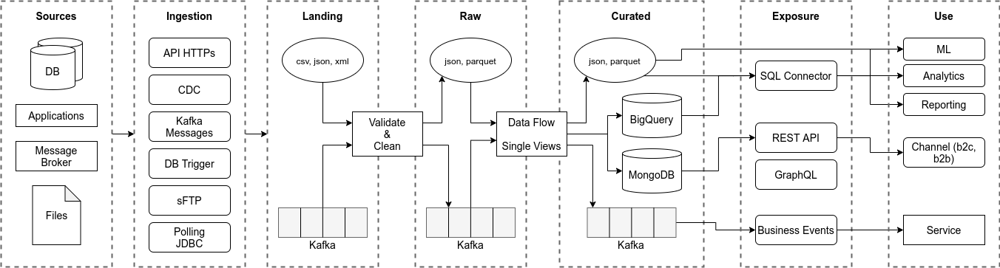
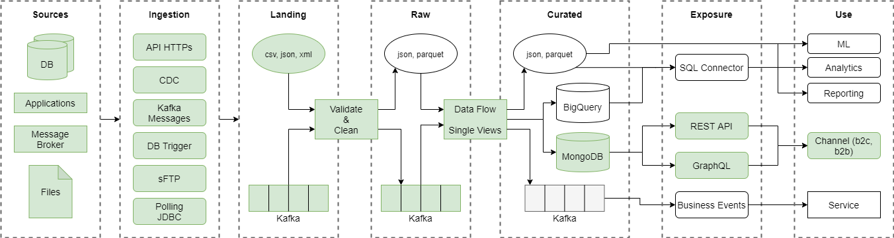
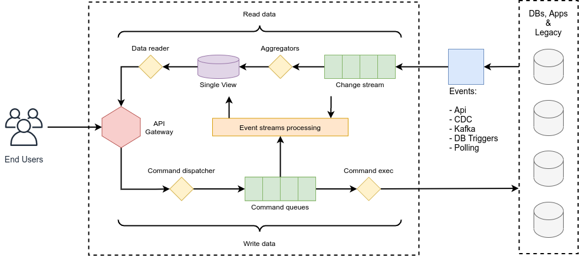
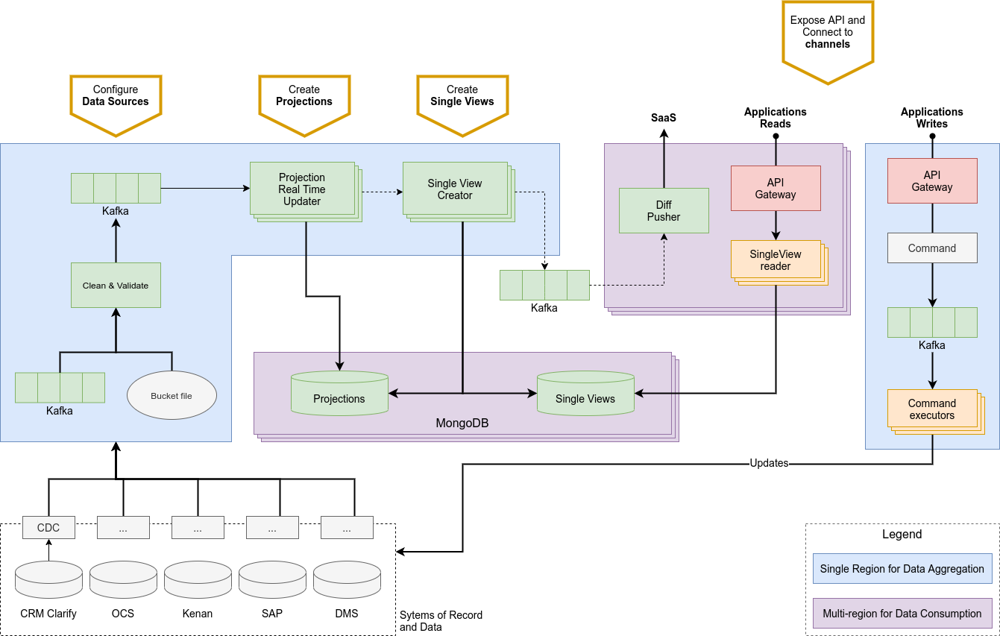

Fast Data is data in motion, a real-time stream of information produced by different sources and organized accordingly
to business needs.

Fast Data main goal is to build a single point of truth to keep the data flow consistent and updated in real-time 24/7.
This can be achieved aggregating business data from different sources into a single collection, called [Single
View](./single_views.md), easily queryable by APIs. On top of that, the aggregation is performed only when needed,
that is when changes occur in the source data.

To summarize, Fast Data allows you to decouple legacy systems and serve digital channels with real-time business Single
Views, achieving:
- data aggregation from different sources,
- data that are always updated in real-time and available 24/7, and
- *Systems of Record* offload from massive reading and writing workloads.

## Data mesh

Fast Data derives from an architectural approach known as **data mesh**. The image below provides an overall view on the
data management flow dictated by this paradigm.

The idea is to capture the information produced by different, heterogeneous **data sources**  in near real-time or
polling through dedicated [ingestion solutions](./data_ingestion.md). The collected data are temporarily stored on a
**landing area**, from where they undergo a progressive **process of refinement**. Finally, these validated data are
[exposed](./api.md) to the different channels for an easy and efficient consumption.

Data Mesh implementations are based on a self-service infrastructure composed by ingestion and aggregation. At the core
of this infrastructure are **data streams**, flows of moving data (e.g., *Kafka topics*) that became events to which
one can subscribe. These data are chronologically ordered, validated, and ready to be consumed for multiple purposes,
like Single Views creation.

The image below highlights a Fast Data flow from the source to the end channel.

## High-level vision

The picture above provides a high-level vision of the Fast Data flow. On one hand we have the **end users**, who need to
quickly and easily interact with the **data sources**, located on the other side of the schema. This interaction is
composed by two branches, one where data are read, and one where data are written.

### Read stream

In the context of data reading, the key goal is to have a set of well-defined, standardized entrypoint which aggregate
the data and are easily accessible by the consumers. This role is covered by the [Single Views](./single_views.md),
pre-defined data structures designed upon the data sources keeping in mind the needs of the end users.

Whenever a change occurs in a data source, a [Connector](./data_ingestion.md) catches the event and saves the
information on a stream. From the stream, the changes are processed asynchronously, and the Single Views effected by
them are updated.

### Write stream

In addition to consuming the data, users also need to be able to trigger changes in the data sources. This can be done
through **commands**, dispatched to a queue from which they can be executed asynchronously.

## Architecture and flow

A more in-depth view of the Fast Data architecture is outlined in the schema below, which highlights the four stages of
the building process.

The first action that has to be taken regards the configuration of data sources. As outlined in the 
[Connectors section](./data_ingestion.md), the sources of data, or *Systems of Record* should be identified and studied
in order to define how the data ingestion should work.

Once the communication with the sources has been established, it comes the process of manipulation, validation, and
shaping of data. This is done through Projections and Single Views, as detailed in the 
[Single View section](./single_views.md).

Finally, the system has to be put in communication with the various channels so that they can consume data and send
commands. The [API section](./api.md) deals with this stage of the flow.
