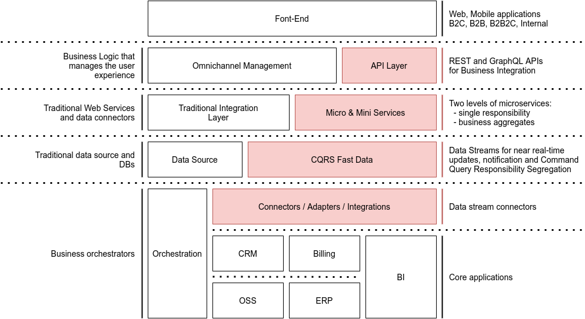

## Digital Integration Hub

The image below highlight the sections that compose the Digital Integration Hub implementation.

The DIH organically places itself within the traditional architecture components providing an efficient, scalable, and
reliable stream that connects the core applications to the end consumers and producers.
