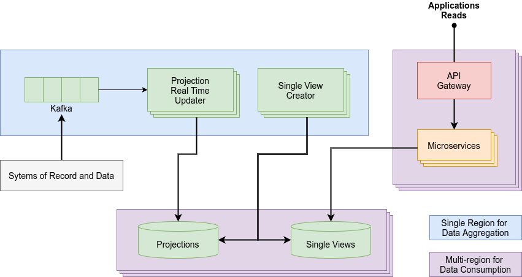
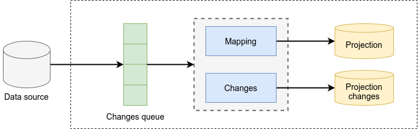
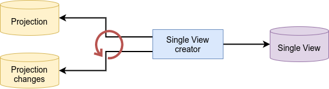
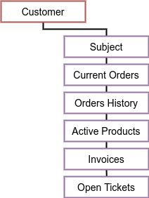

A Single View is an **aggregation of data** built to address the problem of data fragmentation and the complexity of its
management. Single Views collect all the data related to any business object in a single document. This process of
organization and standardization should be guided by business needs with the goal of enabling a better user experience 
across all channels.



## Projections

The process of updating a Single View in response to the changes of the data sources should be abstracted by the
introduction of a system of **projections**. Projections simplify the access to the data storing a standardized
version of the sources' content.

As shown in the image below, each change in the data is queued on a stream. In such a way, a dedicated updater can
asynchronously handle the changes, mapping the new data into the corresponding projection and saving the identifier of the single view that has been updated
in a dedicated **projection changes** collection.



With this abstraction layer in place, Single Views do not need to communicate directly with the sources. Instead, each
Single View is connected with the projections that contain the data used to compose it.

When an addition occurs in the projection changes collection, the services responsible for composing the Single Views
should catch the event, compute which views are affected by the change, and update them accordingly. The following image
illustrates this procedure.



## Designing a Single View

Given the central role that Single Views play in the Fast Data architecture, planning and creating them with care is
crucial for the success of the entire implementation.

The following sections aim at describing the main steps to take when designing your Single Views.

### Preliminary steps

#### Identify Data Consumers

The first information you need to design an effective Single View is how it will be used by the customers. Thinking
ahead about the type of queries that will be executed on it will help you to produce a correct and focused model.

#### Identify Data Producers

Using the data from the previous analysis, you should identify the systems, and the relative databases from which the
relevant data can be extracted. This study requires a deep understanding of the underlying source databases, since you
will need information like schemas, which tables store the data of interest and in what format.

### Identify common fields

Once all the preliminary analysis has been completed, it is important to define common fields that must appear in 
each document. For example, every customer document should contain a unique identifier such as a number, or an email 
address. 

These fields will be the primary key of the Single View and should be **indexed as a primary key**. Analyzing query 
patterns will also help to identify secondary indexes that need to be created.

### Define canonical formats

Since data may be represented with different formats in different systems, it is also needed to define a canonical 
format for each field. For example, a customer phone number may be stored as a string in one system, and as an integer 
in another.

To overcome this problem, you should make use of **cast functions**, which allows you  to store the heterogeneous data
of source tables in a single, well-defined canonical type.

## Single View example

The schema below shows an indicative, high-level structure of a *user-centric* Single View designed to contain the data 
of a **single customer**.



It follows a more detailed [JSON Schema](https://json-schema.org/) of the view as well as a tentative example.

```json
{
  "type": "object",
  "properties": {
    "subject": {
      "type": "object",
      "properties": {
        "fiscalCode": { "type": "string" },
        "vatCode": { "type": "string" },
        "idSubject": { "type": "string" },
        "isLegalEntity": { "type": "boolean" },
        "registry": {
          "type": "object",
          "properties": {
            "name": { "type": "string" },
            "surname": { "type": "string" },
            "dateOfBirth": { "type": "string" }
          }
        },
        "contacts": {
          "type": "array",
          "items": {
            "type": "object",
            "properties": {
              "type": { "type": "string" },
              "contact": { "type": "string" }
            }
          }
        }
      }
    },
    "currentOrders": {
      "type": "array",
      "items": {
        "type": "object",
        "properties": {
          "id": { "type": "string" },
          "number": { "type": "string" },
          "payed": { "type": "boolean" },
          "date": { "type": "string" },
          "details": { "type": "object" }
        }
      }
    },
    "ordersHistory": {
      "type": "array",
      "items": {
        "type": "object",
        "properties": {
          "id": { "type": "string" },
          "number": { "type": "string" },
          "paymentType": { "type": "string" },
          "date": { "type": "string" }
        }
      }
    },
    "activeProducts": {
      "type": "array",
      "items": {
        "type": "object",
        "properties": {
          "id": { "type": "string" },
          "category": { "type": "string" },
          "type": { "type": "string" },
          "startingDate": { "type": "string" },
          "details": { "type": "object" }
        }
      }
    },
    "invoices": {
      "type": "array",
      "items": {
        "type": "object",
        "properties": {
          "id": { "type": "string" },
          "number": { "type": "string" },
          "orderNumber": { "type": "string" },
          "date": { "type": "string" },
          "details": { "type": "object" }
        }
      }
    },
    "openTickets": {
      "type": "array",
      "items": {
        "type": "object",
        "properties": {
          "id": { "type": "string" },
          "operatorNumber": { "type": "string" },
          "isClosed": { "type": "boolean" },
          "issueDate": { "type": "string" },
          "resolutionDate": { "type": "string" },
          "details": { "type": "object" }
        }
      }
    }
  }
}
```

```json
{
  "subject": {
    "fiscalCode": "fiscal_code",
    "vatCode": null,
    "idSubject": "subject_uid",
    "isLegalEntity": "false",
    "registry": {
      "name": "John",
      "surname": "Doe",
      "dateOfBirth": "1980-01-01"
    },
    "contacts": [
      {
        "type": "email",
        "contact": "john.doe@email.com"
      }
    ]
  },
  "currentOrders": [
    {
      "id": "0568_45682_ahfc",
      "number": "45682",
      "payed": false,
      "date": "2021-04-28T16:30:00.000Z",
      "details": {}
    }
  ],
  "ordersHistory": [
    {
      "id": "7822_08036_tkfs",
      "number": "08036",
      "paymentType": "credit card",
      "date": "2021-01-05T08:12:30.000Z"
    }
  ],
  "activeProducts": [
    {
      "id": "0458_85691_efth",
      "category": "mobile",
      "type": "voice",
      "startingDate": "2021-03-16T22:50:03.000Z",
      "details": {}
    }
  ],
  "invoices": [
    {
      "id": "8341_63789_rgui",
      "number": "001523",
      "orderNumber": "08036",
      "date": "2021-01-05T08:12:30.000Z",
      "details": {}
    }
  ],
  "openTickets": [
    {
      "id": "9256_01286_ghjk",
      "operatorNumber": "14689",
      "isClosed": false,
      "issueDate": "2021-02-20T11:00:25.000Z",
      "resolutionDate": null,
      "details": {}
    }
  ]
}
```
