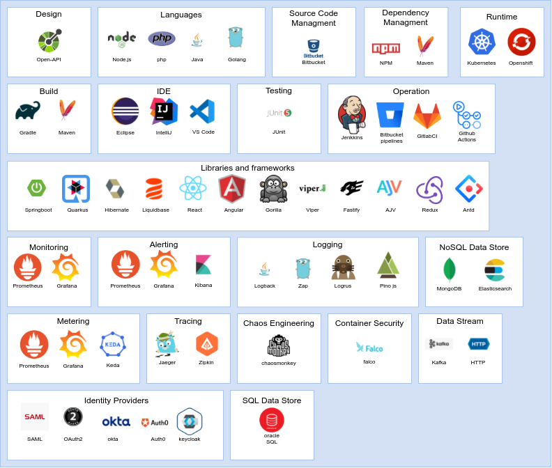

## Dev Tools

### Design

* OpenAPI  - [site](https://swagger.io/)

### Languages

The supported languages are

* Node.js v12 or higher - [site](https://nodejs.org/)
* PHP v7 or higher - [site](https://www.php.net/)
* Java v8 or higher - [site](https://www.java.com/)
* Golang - [site](https://golang.org/)

### Build

The supported build systems are

* Gradle - [site](https://gradle.org/)
* Maven - [site](https://maven.apache.org/)

### IDE

Supported IDEs

* Eclipse - [site](https://www.eclipse.org/ide/)
* IntelliJ IDEA and derivates - [site](https://www.jetbrains.com/idea/)
* VisualStudio Code - [site](https://code.visualstudio.com/)

### Testing

Supported testing frameworks:

* JUnit - Java - [site](https://junit.org/junit5/)

### Source Code Management

* Git - Bitbucket

### Commons libraries and frameworks

* Springboot - Java - [site](https://spring.io/projects/spring-boot)
* Quarkus - Java - [site](https://quarkus.io/)
* Hibernate - Java [site](https://hibernate.org/)
* Liquibase - Java [site](https://www.liquibase.org/)
* React - Javascript - [site](https://it.reactjs.org/)
* Angular - Javascript - [site](https://angular.io/)
* Gorilla - Golang - [site](https://www.gorillatoolkit.org/)
* spf13/viper - Golang - [site](https://github.com/spf13/viper)
* fastify - Node.js - [site](https://www.fastify.io/)
* ajv-validator - Node.js - [site](https://github.com/ajv-validator/ajv)
* redux - React - [site](https://react-redux.js.org/)
* antd - React - [site](https://ant.design/)

### Static Code Analysis

### Dependency Management

* Maven - Java - [site](https://maven.apache.org/)
* Npm - Node.js - [site](https://www.npmjs.com/)

### Developer Portal

## Operation

* Jenkins - [site](https://www.jenkins.io/)
* Bitbucket Pipelines - [site](https://bitbucket.org/product/it/features/pipelines)
* GitlabCI - [site](https://about.gitlab.com/stages-devops-lifecycle/continuous-integration/)
* GitHub Actions - [site](https://github.com/features/actions)

## Runtime and Container Orchestrators

* Kubernetes - [site](https://kubernetes.io/)
* Openshift - [site](https://www.openshift.com/)

### Monitoring

* Prometheus - [site](https://prometheus.io/)
* Grafana - [site](https://grafana.com/)

### Logging

* Logback - Java - [site](http://logback.qos.ch/)
* Zap - Golang - [site](https://github.com/uber-go/zap)
* Logurus - Golang - [site](https://github.com/sirupsen/logrus)
* Pino - Node.js - [site](https://getpino.io/)

### Tracing

* Jaeger - [site](https://www.jaegertracing.io/)
* zipkin - [site](https://zipkin.io/)

### Metering

* Prometheus - [site](https://prometheus.io/)
* Grafana - [site](https://grafana.com/)
* Keda - [site](https://keda.sh/)

### Alerting

* Prometheus - [site](https://prometheus.io/)
* Grafana - [site](https://grafana.com/)
* Kibana - [site](https://www.elastic.co/kibana)

### Chaos Engineering

* chaosmonkey - [site](https://github.com/Netflix/chaosmonkey)

## Security

### Container Security

* Falco - [site](https://falco.org/)

### Identity providers

* SAML - [site](http://saml.xml.org/)
* OAuth 2.0 - [site](https://oauth.net/2/)
* Okta - [site](https://www.okta.com/)
* auth0 - [site](https://auth0.com/)
* keycloak - [site](https://www.keycloak.org/)

## Data

### NoSQL Data Store

* MongoDB - [site](https://www.mongodb.com/)
* Elasticsearch - [site](https://www.elastic.co/)

### SQL Data Store

* Oracle SQL
* Oracle PL/SQL

### Data Streaming

* Kafka - [site](https://kafka.apache.org/)
* Http

### Ingestion

* CDC: Golden Gate, Debezium
* ...

### Files Storage
