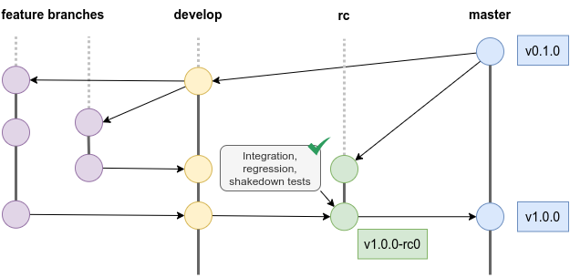
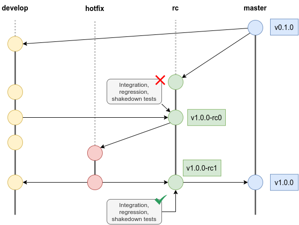
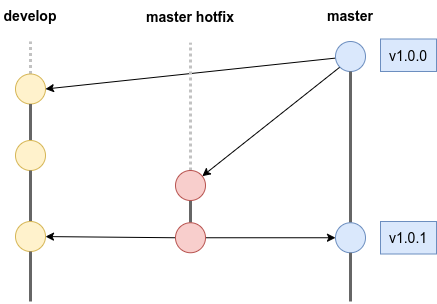
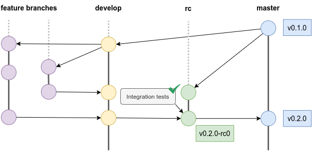

## Overview

This schema shows the Git workflow that should be adopted when working on a project. Each branch has a specific role, and
the interactions between branches should follow a strict policy to enhance productivity and minimize the risk of bugs
and regressions.

The following paragraphs contain a detailed description of each branch and its role.

### Master and develop branches

The branch released in *production environment* is `master`. It stores the official release history and all the commits 
here are tagged with a version number, following the [Semantic Versioning Specification](https://semver.org/).

Being used for releases, the `master` branch contains only an abridged history of the project. The complete project
history can be found in the `develop` branch, which is the one released in *test environment*.

### Feature branches

During the development process, each new feature should reside in its own branch. These `feature` branches are branched
off of `develop` and, when the feature is complete, they get merged back into it and deleted.

:::caution
The content of the `feature` branches should not be released.
:::

### Release candidate branch

When it's time for a release, a `rc`  branch si created from `master`. The content of `develop` is merged in the newly
created `rc` branch, and the commit is tagged with a *release candidate tag*. 

The new features are deployed in *pre-production environment* and undergo a series of integration, regression and 
shakedown tests. If the tests are successful, `rc` is merged into `master` and then deleted. Finally, `master` is tagged.

## Hotfix branches

Hotfix branches are used to quickly patch releases. Such a dedicated line of development for bug fixes and maintenance
allows the team to address issues without interrupting the workflow or waiting for the next release cycle.

### Rc hotfixes

If the tests performed on a release candidate fail, a new `hotfix` branch should be created from `rc`. 

Once the problem is fixed, the `hotfix` branch should be merged back into `rc`, where a new release candidate tag is
created, and the tests are repeated.

:::caution
Before deleting the `hotfix` branch, the fix must also be merged into `develop` to ensure the continuity of the
project history.
:::

### Master hotfixes

A `master hotfix` branch should be created from `master` whenever a bug is production occurs. As with rc hotfixes, the
problem is solved in this dedicated branch, which is then merged back into `master`. Finally, a new *patch tag* should be
created on `master`.

:::caution
Before deleting the `master hotfix` branch, the fix must also be merged into `develop` to ensure the continuity of the
project history.
:::

## Fast tracks

Fast track releases are small releases, which need to undergo just a subset of tests, namely the integration ones,
before being merged into `master`.

Semantically speaking, a fast track release is a *minor release*.  When the `rc` branch is tagged, the pipeline needs to
compare the new tag with the latest `master` tag. If it is a major, all tests are run, if it is a minor, it is
recognised as a fast track release, and the dedicated test suite is triggered.
