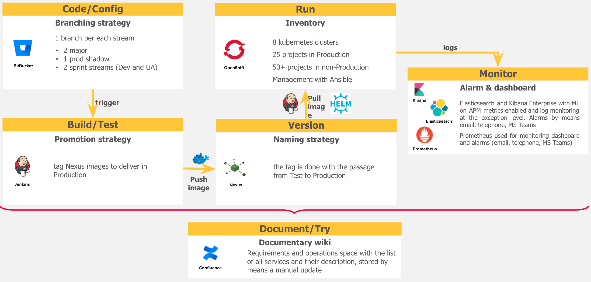

DevOps is a set of methods and practices that allow teams to speedup the software delivery, increase the software robustness and create a common set of rules for operating software in production.

Company name has adopted DevOps practices to implement, delivery and monitoring their applications.

The toolchain adopted is standard and allow to manage the continuous delivery and monitoring of microservices in easy way.

In next sections are defined the git flow, the pipelines standard and metrics for microservices.
