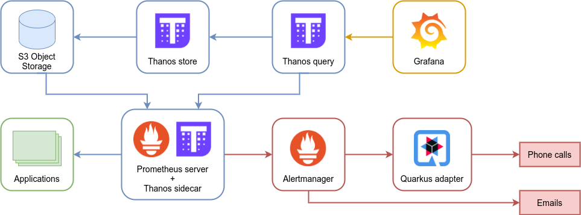
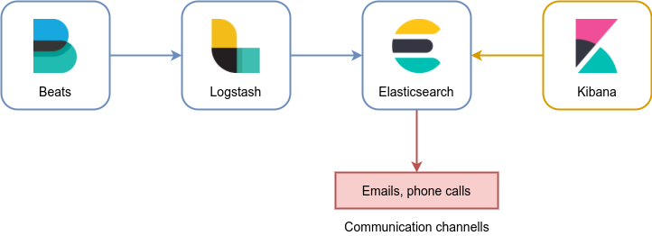
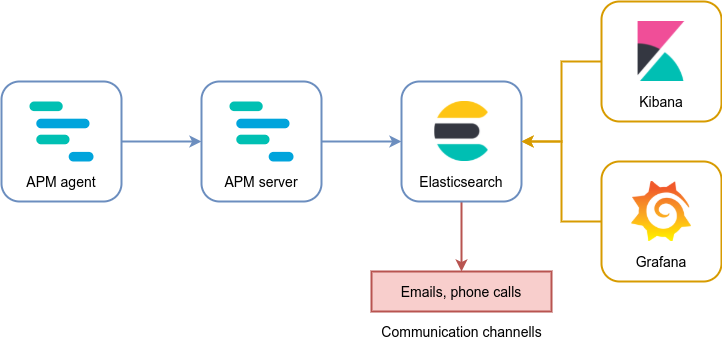

When it comes to monitoring, the goal should be to build a **global monitoring system** designed to collect metrics,
visualize them in a meaningful way, and send useful alarms based.

## Alerting

The schema below shows the stack used for monitoring and alerting purposes.

The core of the systems is [Prometheus](https://prometheus.io/), a widely-used open source software built for event 
monitoring and alerting, while [Thanos](https://thanos.io/) is used for long term storage and deduplication. Thanos
runs daily raw data downscaling for faster queries and Prometheus periodically saves the blocks on S3.

:::note
A notable alternative to Thanos for centralizing the metrics of all the clusters, collecting the form multiple 
Prometheus servers, is [Cortex](https://cortexmetrics.io/). Cortex runs across multiple machines in a cluster, exceeding
the throughput and storage of a single machine, and this enables you to send the metrics from multiple Prometheus 
servers to a single Cortex cluster.
:::

A [Prometheus Alertmanager](https://prometheus.io/docs/alerting/latest/alertmanager/) handles the alerts sent by the 
Prometheus server, grouping and routing them to the correct receiver integration (emails and phone calls).

To complete the stack we have [Grafana](https://grafana.com/grafana/), an analytics platform that enables the querying
and visualization of metrics through customizable dashboards with your team and foster a data driven culture.

### The Prometheus stack

The Prometheus stack is composed by:
- a **Prometheus server**, which is the main service application that pulls metrics and stores them, and 
- any number of **metric exporters**, services that listen to events and expose metrics designed to be consumed by 
  Prometheus itself.

:::tip
To simplify the deployment and the configuration, Prometheus can be deployed with
[Prometheus Operator](https://prometheus-operator.dev/), which uses Kubernetes configurations that can be released
through helm charts.
:::
  
The practices of exposing and updating metrics for a Prometheus instance to scrape is called **instrumentation**. For a
monitoring system to be effective, every library, subsystem, and service should be instrumented, and a Prometheus stack
should be installed on every cluster.

To do so, there exists several exporters that cover almost every well-known system. Metrics about the state of nodes and
pods may be generated with exporters like [kube-state-metrics](https://github.com/kubernetes/kube-state-metrics), while
for services collectable data should be generated using appropriate 
[Prometheus client libraries](https://prometheus.io/docs/instrumenting/clientlibs/).

On top of that, it's worth noting that a pod can also export custom metrics on the `/metrics` path. Among other 
purposes, this is particularly useful to collect **business-based metrics**.

## Logging

The management of logs is handled by the so-called [Elastic Stack](https://www.elastic.co/what-is/elk-stack), 
represented in the schema below.

The components of the stack are:
- [Beats](https://www.elastic.co/beats/), open source data shippers used to send operational data,
- [Logstash](https://www.elastic.co/logstash) for logs ingestion, transformation, and feeding,
- [Elasticsearch](https://www.elastic.co/elasticsearch/) for searching and analysis, and
- [Kibana](https://www.elastic.co/kibana) for visualization.

Any alert regarding logs is sent by Elasticsearch on the configured channels (i.e., emails and phone calls).

## Tracing

Tracing requests by tracking their path through the system is a key practice in a microservices architecture, since
it allows you to analyze performance, providing an end-to-end picture of where the application is spending time, where
errors are occurring, and where bottlenecks are forming.

The schema below provides an overview of the tracing stack.

Once again, [Elasticsearch](https://www.elastic.co/elasticsearch/) is used in conjunction with
[Grafana](https://grafana.com/grafana/) and [Kibana](https://www.elastic.co/kibana) for visualization and dashboards 
creations. 

To collect the needed data, Elastic [APM](https://www.elastic.co/apm) is used. The **APM agents** are libraries 
installed into service to instrument them, collecting performance data and errors at runtime. This data is buffered for 
a short period and sent on to an **APM Server**.
