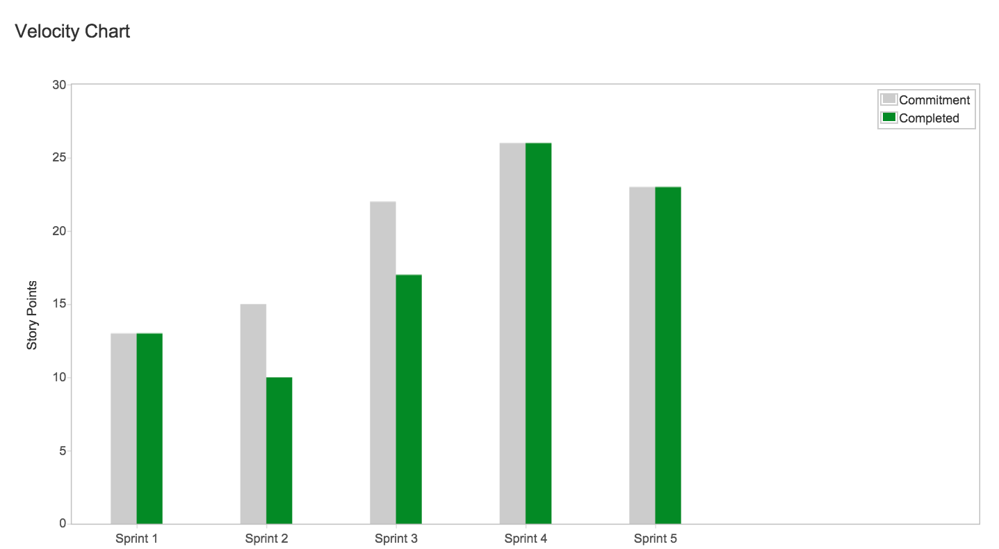
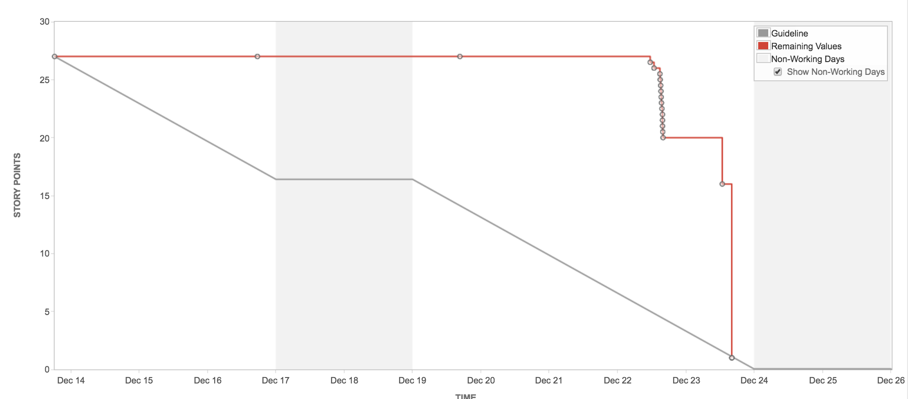
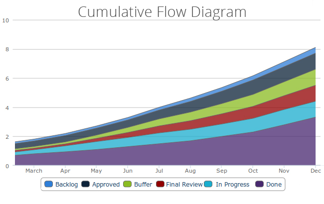

## Introduction

Within an agile organization, there are several metrics that are useful for monitoring and controlling projects and 
quality.

The use of metrics should have two main goals:
* To pursue and drive continuous improvement: metrics give us an indication of where we can improve and validate the 
  effectiveness of the changes we introduce. One of Kanban's practices says "evolve experimentally"; metrics help us 
  treat changes as a series of small experiments that survive only if they prove successful.
* Achieve some degree of predictability (make relatively reliable predictions): predictability is pursued by using the
  historical data we collect to improve our forecasts. 

The following section discusses two types of metrics with different objectives:
* Performance metrics
* Team health metrics

### Performance metrics

#### Velocity

In agile methodologies, velocity is the unit of measure for keeping track of how much work the team can do during an 
iteration. It is a very useful tool for making projections about what can be planned in the next Sprint. Often velocity 
is also used as a rough indication of what can be accomplished in the medium term, and to broadly set a roadmap.

For the calculation of velocity, only user stories that have been completed and validated at the end of each Sprint are 
taken into consideration. The sum of the "completed" story points determines the velocity of each Sprint, and the
arithmetic average of the score of each Sprint determines how much a team is on average able to achieve in an iteration.

#### Burn down chart

A Burn Down Chart is a graphical representation of the work to be done on a project over time. Usually the remaining 
work (or Backlog) is indicated on the vertical axis in the form of Story Points or any other unit of measure chosen to 
estimate the User Stories, while on the horizontal axis we find the time, frequently quantified in number of Sprints.

The diagram, which therefore presents a decreasing trend, represents a historical series of the work to be done. It is 
useful to calculate the velocity of the Team, or the number of Story Points that the team is able to complete in a 
Sprint, and thus predict when the work will be completed.

#### Cumulative Flow Diagram (CFD)

The Cumulative Flow Diagram visualises how tasks mount up over time, together with their distribution along the process 
stages. The graph is built from different colored bands of tasks gathered in various columns. One color represents one
column so that each band shows how many tasks sit at what stage of the process, in a given time (the horizontal value).

The ideal diagram is an evenly rising one, with bands staying more-less even, except for the "completed tasks" band, 
which should continuously be getting taller, just as the number of done tasks is hopefully always getting higher.

Metrics are useful in a variety of contexts:
* A CFD can be used in a retrospective or Root Cause Analysis to reconstruct events in a particular time period and to 
  discuss patterns we observe
* CFD can be used to observe if the "experiments" we introduce have positive or negative effect on the team performance
* From the CFD it is possible to extract some key KPI: Approximate Lead Time, Approximate Work In Progress, Approximate 
  Throughput and projection of the Delivery Date.

In the Cumulative Flow Diagrams, we can highlight a number of recurring patterns, which can give us fairly clear 
indications of the team's problems.

Some of the most typical patterns are:
* Growing lines: indicate large WIP or context switching. A possible action is to use WIP limits
* Stairs: indicates large batches and timeboxed actions
* Flat lines: nothing's moving on the board action. Possible actions are to investigate blockers, focus on finishing, 
  split in smaller stories.
* Single flat line: testing bottleneck action: investigate blockers, pair with testers, automate more
* Dropping lines: items going back action. A possible action is to improve policies

### Team health metrics

#### Team thermometer

The team thermometer is a qualitative tool useful for measuring the motivation and atmosphere of a work team. It is 
advisable to use it in ceremonies such as Scrum retrospectives where the goal is to identify difficulties and unresolved
conflicts.

The team thermometer consists of a simple self-assessment made by each person on the team regarding their state of mind 
in the work environment. Any collaborative tool used during Retrospectives is sufficient. The Scrum Master or meeting 
facilitator prepares a chart representing a thermometer with different degree of commitment. Then each team member 
performs a self-assessment of his or her level of satisfaction regarding the work done in the last period. Once their 
level of satisfaction has been selected, each person shares some feedback with the team regarding:
* What the time should do more of
* What the team should do less of
* What the team should keep doing

The tool can be useful in identifying the presence of unresolved issues or conflicts that can then be explored during 
the retrospective until corrective action is taken and continuous improvement is achieved. In general, this team 
exercise promotes an open and honest conversion about your team, why it works, why it doesn't, and how it could work 
better.
