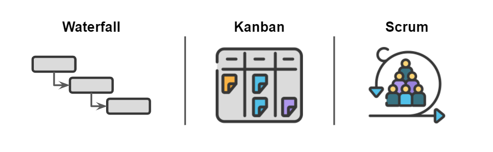
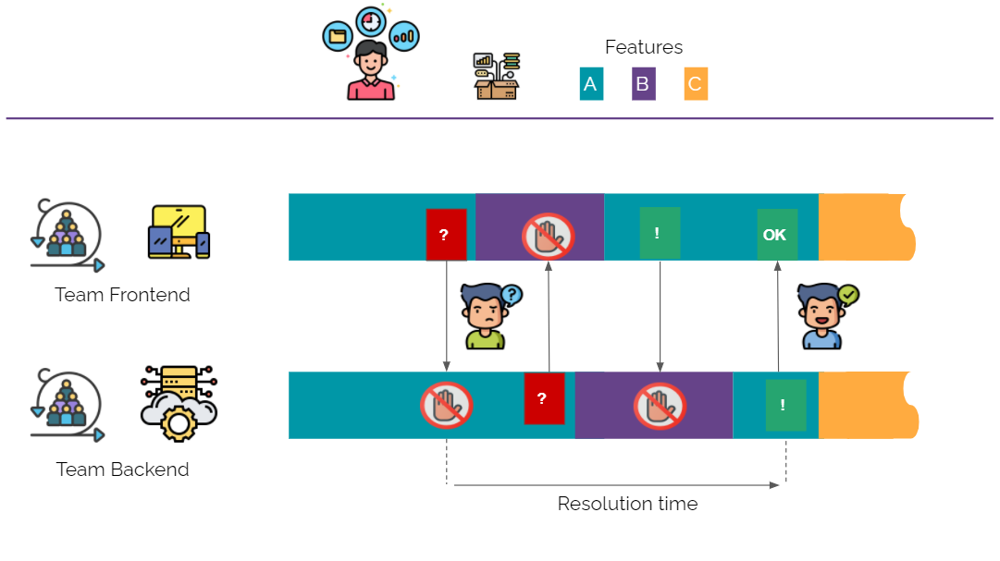
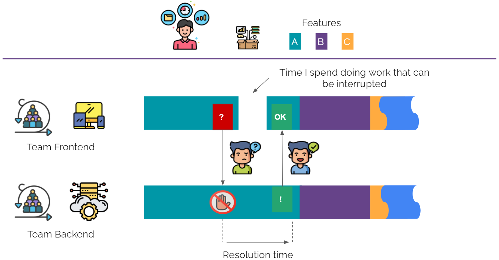
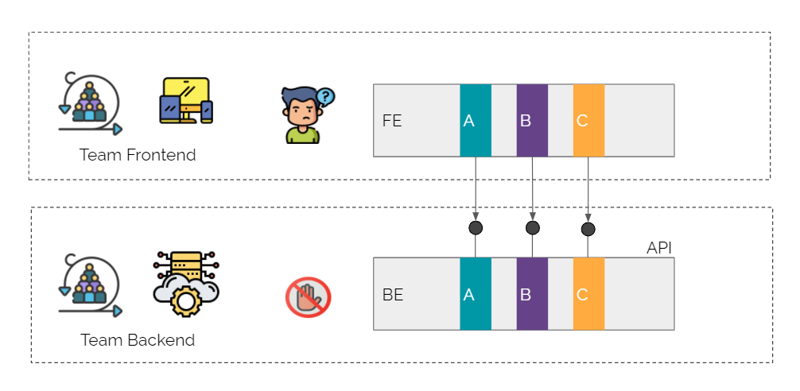
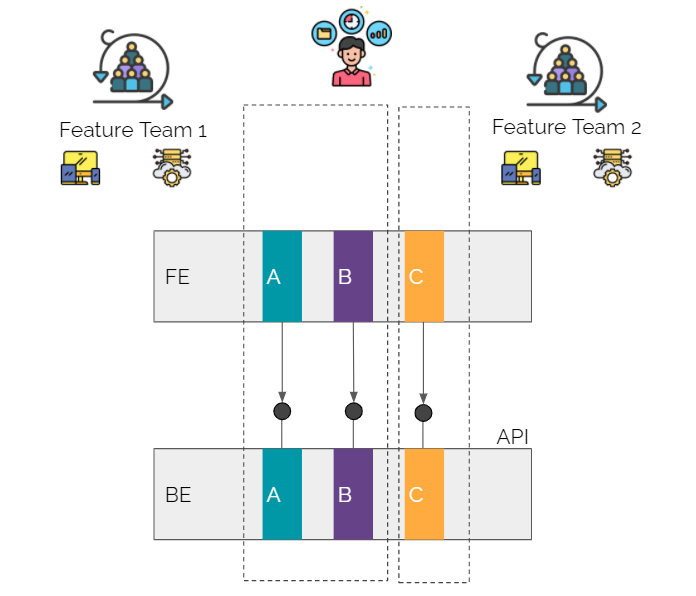

## Methodologies

At the moment there is not a unique approach for all the IT teams, depending on the stream each team may adopt a waterfall, kanban or scrum methodology.

### Waterfall

The waterfall model is a linear project management approach, where stakeholder and customer requirements are gathered at the beginning of the project, and then a sequential project plan is created to accommodate those requirements.

The waterfall approach is suitable for contexts where:

* There are clear initial product and regulatory requirements
* There is little uncertainty
* We expect few scope changes

In all other contexts, it is advisable to adopt a widespread agile organization across the entire department or organization. Following different working methodologies within the same area or between teams that are interdependent erodes the benefits of agile working methodologies: if only some areas become faster, the other areas will remain a bottleneck and this does not allow the company to increase its capacity to innovate.

### Agile - Kanban & Scrum

Some teams including Operation, Digital Services and Integrations work following Agile methodologies. The most used agile methodologies are Kanban and Scrum (Sprints).

The Agile methodology, as opposed to traditional methods, has its roots in the concept of continuous improvement: the possibility of reviewing at different times both the initial specifications and the variations that have emerged during development. In fact, it is based on the deming cycle: a series of steps that allow us to reshape, correct, and test what we are working on.

The main advantages of working following an agile methodology are:

* **Reduced costs:** being able to continuously check the evolution of the project allows you to implement the necessary changes when you are still running and avoid having to make big, and expensive, changes only once the project is over;

* **Increased collaboration:** This methodology encourages continuous discussion both within the team and between the team and the stakeholders;

* **Greater trust:** the possibility of continuous testing and of being able to participate actively and consciously in all the steps of the project allows all the people involved to have greater trust in the work of their colleagues;

* **Greater flexibility:** the objective of the agile methodology is not so much to give a definitive answer on the management of a project, but to give precise rules on how to act in contexts of continuous change, in order to draw value from them.

#### Scrum

Scrum is a framework for developing and supporting complex products.
It is, in fact, a framework, which makes it more flexible than other methodologies, and therefore more easily applicable
to many contexts.

There are several aspects that characterize Scrum, we can list some of them:

* **Roles:** the Product Owner, the person responsible for the implementation and evolution of the product in a given project, who interfaces with the client; The development team; the Scrum Master, the process manager, who is sometimes also part of the development team anyway, knows how to best apply the Scrum methodology.

* **Artifacts:** The Product Backlog, the list of the team's activities needed to build the product; this list of activities is then called up from time to time in the Sprint Backlog, which collects the activities to be done in a given period.

* **Events:** these are the moments of the scrum such as Sprint Planning, when the team plans the activities of the next
  period - the sprint - which can last one or several weeks; the Stand-up, the 15-minute meeting at the beginning of the
  day to align on the previous day, on the one about to begin and to bring out issues that are hindering us; the Retrospective, a moment of in-depth discussion on how a particular project went or how the team is generally going.

#### Kanban

Kanban is an agile work methodology that aims to improve workflow while increasing productivity and the quality of the final product.

Kanban can be easily incorporated into any teamwork structure and at different organizational levels:

* **Operational level:** At this level is the team of specialists who are engaged in the day-to-day production of the product or delivery of the service.
* **Coordination:** At the second level we find coordination between teams. With Kanban, you make sure that all teams complete tasks in the right sequence and that they always have work. Thus, each team is neither overloaded nor lacking in work.
* **Strategic portfolio management:** you reach the third level when you coordinate not just one project with Kanban, but the entire portfolio with the agile method. It is management that decides which project to start with. This can improve all business processes.

## DIH enabled governance: Feature Teams

The setup of a digital integration hub facilitates the adoption of new organizational forms among which are *Feature Teams*.

### Problem solved

Feature teams is a form of organization that aims to increase the effectiveness of the output of individual development teams.

Single-skill scrum team organization leads to strong interdependence between different teams, which results in evident challenges in synchronizing activities related to a single project. If in order to develop a certain functionality the scrum team dedicated to FE needs an API exposed by the BE team there might be some dynamics where the BE team can't fulfill that request leaving the other team on hold. 

In this type of situation, time-to-market automatically slows down and stress gets higher. Not only that, trying to go
into production anyway can cause: low quality of the work, less tests, spaghetti code, unexpected events and bugs that typically occur at the least appropriate time.

### A concrete example

Let's think about a Product Owner (henceforth PO) who manages an e-commerce and wants to send 3 features into production:

* Product Catalogue;
* Product Purchase;
* Product Review.

#### How does the PO manage them?

Typically, e-commerce activities have a mobile app, a website, and a set of back-end services that need to be developed.

Therefore, we will have two teams, one front-end, and one back-end, which will start working together on the first feature: the catalog.

At some point, a teammate of the front-end team needs support from the back-end team. The back-end team is available to help but needs time to better understand the request. The front-end team, while waiting for support, starts developing a new feature.

When the back-end team has understood the request, and it is ready to meet and work on it, the front-end team is busy developing the new feature. So, it is a waste of time.

It is hard to align the agendas until, at last, there is time to meet to decide the next feature.

When two teams start working on a feature A, and there is a problem that forces a team to wait, the team that waits should not start developing a new feature but should use that time to work on what has been done.

For example, the team could improve code quality and test performances, conduct code reviews, and share knowledge. Therefore, the team could carry out activities that can be easily interrupted when the back-end team is ready to keep working on the problem that emerged.

In this way, it will be faster to close the first feature, move on to the next, speed up the time-to-market, and quickly
bring what the customer demands into production.

This is a solution that works well when there is one problem at a time. Although, we know that problems can occur in the
same phase, and we could risk spending more time fixing our code than developing.

However, in a work context where the goal is to reduce time-to-market at sustainable costs, this method may not always 
be the most effective.

#### How do we sync the two teams?

Let's go back to our PO, our back-end and front-end teams, but let’s turn the situation around.

The idea is to avoid having two teams working in parallel on back-end and front-end. The ultimate idea would be to have two teams working on single features vertically, combining back-end and front-end skills, and operating end-to-end throughout the life cycle of a feature.

#### What is a feature team?

It is a cross-functional team with skills in front-end and back-end development, API design and maintenance, knowledge of business logic, testing, deployment, and operations. In other words, it is a team that knows how to manage its features independently, as a small startup, with a view to what the end-customer wants and needs.

Having this kind of organization is not so easy. But it is a good way to have different teams that keep developing features following the stop-starting, start-finishing principle. In addition, if any difficulty emerges, the team has all the necessary skills to handle it independently. Communication is easier. There is less stress. Quality and performance increase.

### Feature team sizing

Identify and form a feature team it's a complex task because it depends on several factors:

* individual competencies;
* dependencies between different software components;
* internal compliance company processes;
* business organization.

It is suggested to form feature teams following those rules:

* **team size**: it's similar to to Scrum team, from 5 to 10 members. This allow to simplify internal team communication;
* **team competencies**: it's cross-functional team and is able to create and deliver a feature autonomously. This speedup the time-to-market;
* **continuous improvement**: plan regular retrospective cross feature teams in order to improve the intra-team communication and reduce dependencies;
* **decouple software responsibilities**: create software architectures that can evolve and where each team can contribute in parallel. Microservices styles are a good way to achieve that goal.

## Open Source (OSS) Platform Governance Model

The open-source model is a decentralized software development model that encourages open collaboration. A government model based on open source principles allows to introduce a culture where the code belongs to everyone, and everyone has the right to put his hands on it, and the duty to keep it clean and performing.

Collective code ownership is one of the practices of extreme programming and in open source it has been declined by creating teams that are maintainers and teams that are contributors.

Introducing the concept of maintainer and contributor in the company organization allows the conversation between teams to evolve effectively, avoiding many bottlenecks. The contributor team is likely to be slower than the maintainer team, but it gains know-how over time and allows many future slowdowns to be reduced.

According to this model, the responsibility for the maintenance and management of the digital platform is the responsibility of a Core Team. The digital services team is ultimately responsible for the evolution of the digital integration hub, providing all the services needed to enable the work of the product teams (e.g. B2b, B2c, Omnichannel).

The digital integration hub enables the work of the areas responsible for digital product development. (e.g. B2b, B2c, Omnichannel) Areas are divided into feature teams, assigned to different digital touchpoints.

**Product teams** are cross-functional (containing digital business people, solution architects, software developers) and autonomous in development using the underlying platform in a self-service mode wherever possible. The same product teams play the role of Contributors within the digital integration hub, in fact, knowing well the needs of business contribute in first person or suggest ideas for improvement for the evolution of the platform.

To summarize **Product teams** leverage platform capabilities for Business and are **contributors** for Platform evolution.

To facilitate collaboration between people and enable knowledge development, it's good to keep 4 key pillars in mind:

* One product, one product owner, one product backlog, one feature team: with one central coordination, and a focus of all teams on business value generated for the user, every line of code generates value for the end user. Nothing is done outside what can generate the most value to the end user. Even what is part of the back-end.

* Standards and processes emerge from people's work: introducing best practices such as mob programming, code writing across teams, and regular code reviews allow for shared standards of code writing.

* Don't fall in love with technology: it is advisable to introduce the opportunity to discuss ideas and encourage comparison and experimentation with new languages, even if they are different from the standards currently in place.

* Practice continuously: writing code is a profession that requires a lot of practice. Kata are for example an activity that helps to improve through the performance of exercises, even simple ones, but always to the maximum of one's potential and ability to develop.
