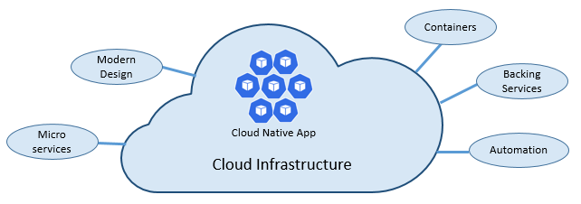

Cloud native is the group of technologies that empower organizations to build and run scalable applications in modern, 
dynamic environments such as public, private, and hybrid clouds.  
Containers, service meshes, microservices, immutable infrastructure, and declarative APIs exemplify this approach.

These techniques enable loosely coupled systems that are resilient, manageable, and observable.  
Combined with robust automation, they allow engineers to make high-impact changes frequently and predictably with minimal toil.

## Cloud Native Computing Foundation (CNCF)

*Mia-Platform* is **Silver Partner** of the [CNCF](https://www.cncf.io/about/members/),
an organization that seeks to drive adoption of this paradigm by fostering and sustaining an ecosystem of open source, 
vendor-neutral projects.

They democratize state-of-the-art patterns to make these innovations accessible for everyone.

## Why be cloud native?

Applications are getting bigger and therefore increasing their user base, which they expect low response time and 24/7 availability.  
*Cloud native* methodologies provide all the necessary to be fast and agile, allowing you to reduce the time needed to go in production, and so the *time-to-market*.

In *Mia-Platform* we release several times a day, without cause downtime.

## Cloud native pillars

A cloud native infrastructure has five fundamental pillars: they enrich the normal cloud infrastructure.  
This can be represented with the following diagram:

### Microservices

We already spoke about *microservices* in the [dedicated section](./microservices_principles.md): the issues addressed remain valid also in this case.

### Modern design

An example of modern design for *cloud native* is *twelve-factor*, a methodology that define twelve principles and procedures
that must be followed to write optimized cloud applications: with this approach, the systems would be easy to scale and 
distribute even between different environment.

The twelve factor principles are:
1. **codebase**: the codebase of each microservice must have a dedicated version controlled repository;
2. **dependencies**: each microservice has its own dependencies and does not share them with other microservices;
3. **configurations**: the configurations of a microservice are stored outside it,
   this allows to apply a different configuration for each environment;
4. **support services**: support services (or external services) must be reachable with configurable URLs;
5. **build, versioning and execution**: each version of the software must have a separated phase of build, versioning and execution.
   Each version must have a unique ID, to allow an easy roll-back;
6. **processes**: each microservice must be executed in a separated and isolated process.
   In addition, its state must be externalized to a distributed cache or data store.
7. **port binding**: each microservice must be self-contained with its interfaces and functionality exposed on its own port;
8. **concurrency**: services scale out across many small identical processes as opposed to scaling-up a single large instance on the most powerful machine available;
9. **disposability**: service instances must be disposable, favoring fast startups to increase scalability opportunities and graceful shutdowns to leave the system in a correct state;
10. **environment parity**: environments involved in the application lifecycle should be as similar as possible;
11. **logging**: treat logs generated by microservices as event streams, process them with an event aggregator and propagate the result to log management tools.
   We already discussed logging in the [dedicated section](./logging.md);
12. **admin processes**: run administrative/management tasks as one-off processes. Tasks can include data cleanup and pulling analytics for a report

    :::note
    Also exists an extension of the *twelve-factor* principles, that adds other 3 rules:
    ::::
13. **api first**: make everything a service;
14. **telemetry**: each application must include a collection of monitoring, domain-specific, and health/system data.
    We spoke about this in the [monitoring chapter](./monitoring.md);
15. **authentication**: implement identity from the start.

### Containers

Containers are a great enabler of cloud-native software: containerizing a microservice is simple and straightforward,
because the code, its dependencies, and runtime are packaged into a binary called a container image.  
Images are stored in a container registry, which acts as a repository or library for images; 
they can be located on your development computer, in your data center, or in a public cloud

[Docker](https://www.docker.com/), the most popular container engine, maintains a public registry: [Docker Hub](https://hub.docker.com/).

A container can therefore be considered a running image instance.

### Backing services

A backing service is any service the app consumes over the network as part of its normal operation, as: 
datastores, messaging/queueing systems, SMTP services, caching...

Backing services promote the "statelessness", which is defined in the #6 factor.

A best practice is to treat a backing service as an attached resource, dynamically bound to a microservice with information stored in an external configuration:
this allows to attach or detach a backing service without code changes.

### Automation

*Infrastructure as Code* (IaC) is the management of infrastructure in a descriptive model, using the same versioning as DevOps team uses for source code:
it allows you to automate platform provisioning and application deployment.

IaC is idempotent, meaning that you can run the same script over and over without side effects: when the descriptive model is changed,
it can be re-run and only the updated resources are affected.

Automatic deployment are made using *pipelines*, already discussed in the [GitOps section](./git_ops.md)

## Conclusion

In this chapter we discussed cloud native and provided a definition along with the key capabilities that drive a cloud-native application.

With these notions, we can now dive into the *de-facto* standard tool to manage containerized applications: *Kubernetes*.
