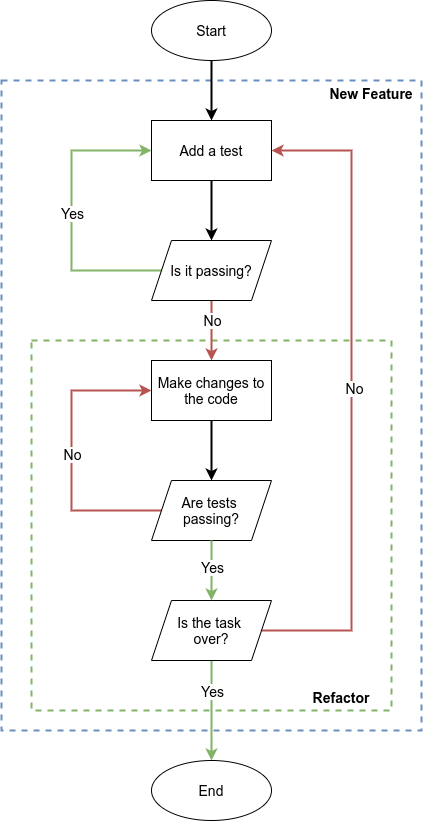
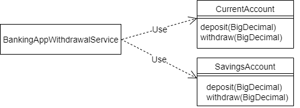
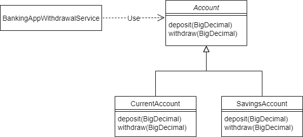

This section covers the best practices one should follow to create readable, testable, maintainable, and performant code.

:::note
The principles explained in this section are language and paradigm agnostic.
:::

Let's begin to see software as a pyramid: it is made of bricks, which are coupled in a specific way.

## Test Driven Development 

Test Driven Development (TDD) is a software development approach in which test cases are developed to specify and 
validate what the code will do. The simple concept of TDD is to write and correct the failed tests before writing new code. 

This technique will force developers to firstly write tests, which will ensure the desired behavior of the software and
can be used to make code refactors. For a good result, we advise that tests should cover at least 85% of running code.

This procedure can be summarized with the following schema:



## Clean code

Once the tests have been written, the developer should start developing the business logic of the system, and this is 
when **clean code** practices come into play.

Clean code embraces several aspects of programming, which can summarize with the following guidelines.

- **[Meaningful names](./development#meaningful-names)**: name everything (variables, functions, classes) logically, 
  use business words to scope your logic. Every programmer should be able to understand what you're doing just by 
  reading the source code.
  
- **[Functions and classes](./development#functions-and-classes)**: functions and classes should be small, easily 
  testable and should do only one thing to avoid duplication.
  
- **[Comments](./development#comments)**: comments should not be used to describe what the code do, in order to avoid 
  misalignment.
  
- **[Information hiding](./development#information-hiding)**: hide the implementation detail to avoid extensive 
  modifications if the design decision is changed.
  
- **[Exceptions](./development#exceptions)**: when they occur, exceptions should always provide the context in which 
  they happened.
  
- **[Avoid null](./development#avoid-null)**: do not pass or return `null` values.
  
- **[Abstract your code](./development#abstract-your-code)**: don't directly depend on code that you can't control 
  (e.g., third-party code).

### Meaningful names

When choosing names for your artifacts, one should try to follow this simple rules.

- **Avoid disinformation**: the names of classes, variables and functions should avoid disinformation.<br/>
  E.g., avoid names like `String n` or `List retrievedList` and prefer instead `String name` or `List retrievedNames`.
- **Make meaningful distinctions**: in functions, for example, make a clear signature definition.<br/>
  E.g., avoid functions like `user(s1, s2, date)` and prefer instead `buildUser(name, surname, birthDate)`.
- **Use pronounceable names**: this will facilitate the communication between developers.<br/>
  E.g., instead of `modYmdhms` and `genYmdhms` use `modificationTimestamp` and `generationTimestamp`.
- **Use searchable names**: use names that are easy to find in the source code.<br/>
  E.g. instead of hard-coding the number `5`, create a proper variable called `WORK_DAYS_PER_WEEK`.

### Functions and classes

The length body of each implemented function or method should be **at most** 10 rows. You can use this rule to create 
more methods or more functions that do **exactly one thing**.

Consider the following example from the
[NodeJS documentation](https://nodejs.org/api/http.html#http_http_get_url_options_callback):

```javascript
http.get('http://nodejs.org/dist/index.json', (res) => {
  const { statusCode } = res;
  const contentType = res.headers['content-type'];

  let error;
  // Any 2xx status code signals a successful response but
  // here we're only checking for 200.
  if (statusCode !== 200) {
    error = new Error('Request Failed.\n' +
                      `Status Code: ${statusCode}`);
  } else if (!/^application\/json/.test(contentType)) {
    error = new Error('Invalid content-type.\n' +
                      `Expected application/json but received ${contentType}`);
  }
  if (error) {
    console.error(error.message);
    // Consume response data to free up memory
    res.resume();
    return;
  }

  res.setEncoding('utf8');
  let rawData = '';
  res.on('data', (chunk) => { rawData += chunk; });
  res.on('end', () => {
    try {
      const parsedData = JSON.parse(rawData);
      console.log(parsedData);
    } catch (e) {
      console.error(e.message);
    }
  });
}).on('error', (e) => {
  console.error(`Got error: ${e.message}`);
});
```

We suggest the following refactor:

```javascript
const ALLOWED_STATUS_CODE = 200;

const statusCodeError = ({statusCode}) => {
  if (ALLOWED_STATUS_CODE !== statusCode) {
    return new Error(`Request Failed.\nStatus Code: ${statusCode}`);
  }
}

const contentTypeError = (res) => {
  const contentType = res.headers['content-type'];
  if (!/^application\/json/.test(contentType)) {
    return new Error(`Invalid content-type.Expected application/json but received ${contentType}`);
  }
}

const searchForError = (response) => {
    return statusCodeError(response) || contentTypeError(response)
}

const manageFoundError = (response, responseError) => {
  console.error(responseError.message);
  res.resume();
}

const manageResponseRawData = (rawData) => {
  try {
    const parsedData = JSON.parse(rawData);
    console.log(parsedData);
  } catch (e) {
    console.error(e.message);
  }
}

const manageValidResponse = (response) => {
  let rawData = '';
  response.setEncoding('utf8');
  response.on('data', (chunk) => rawData += chunk);
  response.on('end', () => manageResponseRawData(rawData));
}

http.get('http://nodejs.org/dist/index.json', (response) => {
  const responseError = searchForError(res);
  if (responseError) {
      manageFoundError(response, responseError);
  } else {
      manageValidResponse(response);
  }
}).on('error', (e) => {
  console.error(`Got error: ${e.message}`);
});
```

### Comments

Try to avoid using comments as an explanation of what the code does, since subsequent refactors could bring to a
misalignment between the codebase and the comment itself.

Consider the following snippet from the previously unrefactored example:

```javascript
  // Any 2xx status code signals a successful response but
  // here we're only checking for 200.
  if (statusCode !== 200) {
    error = new Error('Request Failed.\n' +
                      `Status Code: ${statusCode}`);
  } else if (!/^application\/json/.test(contentType)) {
    error = new Error('Invalid content-type.\n' +
                      `Expected application/json but received ${contentType}`);
  }
```

What if we start to consider valid only the `statusCode` 202? We would change the condition on the code, nothing would
prevent us from leaving the comment untouched, and this will create a potentially confusing and dangerous misalignment.

Instead, when needed, use comments as an explanation of intent or clarification of code.

### Information hiding

Consider the following function

```javascript
function Rectangle()
{
    this.height = 0;
    this.width = 0;
    this.calculateArea = function(){
        return this.height * this.width;
    };
}
```

If you decide to change the variables `height` and `width` to `rectangleHeight` and `rectangleWidth`, you must change
all the code that uses them. This can be avoided using information hiding and refactoring the codebase like this:

```javascript
function Rectangle()
{
    var rectangleHeight;
    var rectangleWidth;
    this.calculateArea = function() {
        return rectangleHeight * rectangleWidth;
    };
    this.setWidth = function(newWidth){
      rectangleWidth = newWidth;
    };
    this.setHeight = function(newHeight){
      rectangleHeight = newHeight;
    };
}
```

### Exceptions

All the exceptions must provide the reason that generated them in the first place.  

For example, avoid using forms like `throw new Error("An error accoured")` and prefer more detailed explanations, like
`throw new Error("Invalid status code response, it should be ... but was ...")`.

### Avoid null

`null` or `undefined` values undermine the stability of your system, generating error like
`Uncaught TypeError: Cannot read property '...' of undefined` or `NullPointerException`.

Modern languages introduced the concept of `optional` or `nullable`. In order to manage the aforementioned situations,
we always suggest using them.

### Abstract your code

To follow this guideline, sometimes is sufficient to wrap an external library in a class or function that you can control.  

Consider for example the communication with external RESTful services. You should avoid using directly the `HttpClient` 
provided by the language or by external libraries and instead construct your own starting from them.

A code like the following

```typescript
HttpClient client = HttpClient.newBuilder()
        .version(Version.HTTP_1_1)
        .followRedirects(Redirect.NORMAL)
        .connectTimeout(Duration.ofSeconds(20))
        .proxy(ProxySelector.of(new InetSocketAddress("proxy.example.com", 80)))
        .authenticator(Authenticator.getDefault())
        .build();
HttpResponse<String> response = client.send(request, BodyHandlers.ofString());
System.out.println(response.statusCode());
System.out.println(response.body());
```

should be refactored as

```typescript
class MyHttpClient {
  private Version httpVersion = Version.HTTP_1_1;
  private Redirect followRedirects = Redirect.NORMAL;
  private Duration timeoutDuration = Duration.ofSeconds(20);
  private Authenticator authenticator = Authenticator.getDefault();
  public String connectionAddress;
  
  public MyHttpClient(final String connectionAddress) {
    this.connectionAddress = connectionAddress;
  }
  
  public HttpResponse<String> retrieveResponse(final Object request) {
    return createClient().send(request, BodyHandlers.ofString());
  }
  
  private HttpClient createClient() {
    return HttpClient.newBuilder()
        .version(Version.HTTP_1_1)
        .followRedirects(Redirect.NORMAL)
        .connectTimeout(Duration.ofSeconds(20))
        .proxy(ProxySelector.of(new InetSocketAddress(connectionAddress, 80)))
        .authenticator(Authenticator.getDefault())
        .build();
  }
}

final MyHttpClient myHttpClient = new MyHttpClient("proxy.example.com")
HttpResponse<String> response = myHttpClient.retrieveResponse();
System.out.println(response.statusCode());
System.out.println(response.body());
```

### The cost of bad code
 
At first, developers may feel comfortable writing bad code, since it seems to work right away and with a small effort.   
While this is initially true, bad code inevitably leads to an increase of complexity, and a consequent decrease of 
productivity, until the codebase becomes totally unproductive.

According to [Robert C. Martin](http://cleancoder.com), one of the founder of the 
[SOLID principles](./development#solid-principles), the decline of productivity can be represented with the following 
graph:


## SOLID principles

SOLID is a mnemonic acronym for five design principles that tell us how to arrange and correlate functions and data 
structures.

The five principles are the floowing.

- **[Single responsibility principle](./development#single-responsibility-principle-srp)**: a module should be 
  responsible to one, and only one, actor.
- **[Open-closed principle](./development#open-closed-principle-ocp)**: a software artifact should be open for extension
  but closed for modification.
- **[Liskov substitution principle](./development#liskov-substitution-principle-lsp)**: a module is 
  interchangeable to another if the behaviour of the system doesn't change.
- **[Interface segregation principle](./development#interface-segregation-principle-isp)**: the software 
  should not be forced to depend on methods it does not use.
- **[Dependency inversion principle](./development#dependency-inversion-principle-dip)**: the software should 
  refer only to abstraction, not to concretizations.

### Single responsibility principle (SRP)

Consider the `TextManipulator` class.

```typescript
public class TextManipulator {
    private String text;

    public TextManipulator(String text) {
        this.text = text;
    }

    public String getText() {
        return text;
    }

    public void appendText(String newText) {
        text = text.concat(newText);
    }
    
    public String findWordAndReplace(String word, String replacementWord) {
        if (text.contains(word)) {
            text = text.replace(word, replacementWord);
        }
        return text;
    }
    
    public String findWordAndDelete(String word) {
        if (text.contains(word)) {
            text = text.replace(word, "");
        }
        return text;
    }

    public void printText() {
        System.out.println(textManipulator.getText());
    }
}
```

Although the code may seem fine, it is not a good example of the SRP because it has two responsibilities: manipulating 
and printing the text. 

To avoid this problem, we should move the `printText` to another class:

```typescript
public class TextPrinter {
    TextManipulator textManipulator;

    public TextPrinter(TextManipulator textManipulator) {
        this.textManipulator = textManipulator;
    }

    public void printText() {
        System.out.println(textManipulator.getText());
    }
}
```

### Open-closed principle (OCP)

To explain this principle, we will consider the following calculator example:

```typescript
public interface CalculatorOperation {}

public class Calculator {
    public void calculate(CalculatorOperation operation) {
        if (operation == null) {
            throw new InvalidParameterException("Can not perform operation");
        }

        if (operation instanceof Addition) {
            Addition addition = (Addition) operation;
            addition.setResult(addition.getLeft() + addition.getRight());
        } else if (operation instanceof Subtraction) {
            Subtraction subtraction = (Subtraction) operation;
            subtraction.setResult(subtraction.getLeft() - subtraction.getRight());
        }
    }
}
```

This class violates the principle since every time you add a new operation, you have to change its implementation.

A better, OCP compliant solution could be:

```typescript
public interface CalculatorOperation {
    void perform();
}

public class Calculator {
    private checkOperation(CalculatorOperation operation) {
        if (operation == null) {
            throw new InvalidParameterException("Cannot perform operation");
        }
    }
    
    public void calculate(CalculatorOperation operation) {
        checkOperation(operation);
        operation.perform();
    }
}
```

### Liskov substitution principle (LSP)

The following diagrams provide an explanation of the LSP.



If you look at the `BankingAppWithdrawalService`, you can see that it has a direct dependency to `CurrentAccount` and 
`SavingsAccount`: even if they have the same methods, they can't be swapped.

To make it possible, you should extract an `Account` interface to abstract the service dependency as follows:



### Interface segregation principle (ISP)

Take a look at this interface

```typescript
interface Payment { 
    initiatePayments: () => void;
    status: () => any;
    getTransactions: () => Transaction[];
    startLoanSettlement: () => void;
    extinguishLoan: () => void;
}
```

It violates the ISP because its methods operate on both simple payments and loans, while simple payments should not manage
loans and vice versa.

To prevent this, we can split the interface in two, smaller interfaces:

```typescript
interface Payment { 
    initiatePayments: () => void;
    status: () => any;
    getTransactions: () => Transaction[];
}

interface LoansPayment extends Payment {
    startLoanSettlement: () => void;
    extinguishLoan: () => void;
}
```

### Dependency inversion principle (DIP)

Bringing back the calculator example provided for [OCP](./development#open-closed-principle-ocp), with the introduction 
of a well-defined interface `CalculatorOperation`, the higher level `Calculator` class does not depend on implementation
details like `Addition` and `Subtraction`.

## Conclusions

Following the guidelines provided in this page will bring the development team to build clean, robust, and easily 
maintainable software.

However, sometimes it might not seem enough, and that's where the 
[source code quality management](./sc_quality_management.md) comes in.
