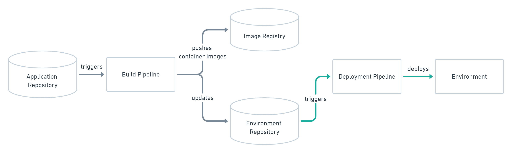
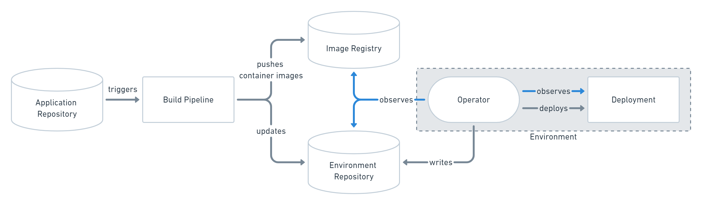
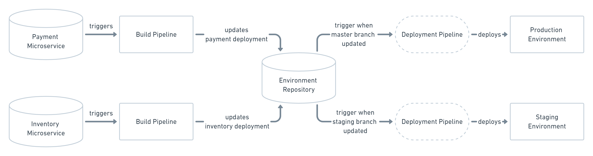

In this section we will talk about GitOps: a way of implementing Continuous Deployment for cloud native applications.  
It allows to make the production environment with an automated process stored in git repositories.

## Why should I use GitOps?

GitOps is used mainly to reduce the human errors on production environments, but we noticed other benefits like:
- **Faster deploys**: GitOps allows you not only to deploy your application faster thanks to Continuous Deployment technologies,
  but also to use the same version control tools, where everything happen;
- **increased deployments number**: with faster deploys, you are able to increase the number of deployments that you can do
  every day;
- **easy rollbacks**: thanks to version control tools, you can do a system rollback using standard commands like `git revert` or `git reset`;
- **better documentation**: GitOps force you to write, so to document, what you must do to set up the environment.  
  These operations must be stored in the repository and will be executed everytime;
- **keep history**: every change to deployments actions are marked with a commit, that can be used to rebuild the history behind a fix or change. 

## GitOps methodologies

GitOps allows you to choose between two different strategies to implement it:
[push-based](./git_ops.md#push-based) and [pull-based](./git_ops.md#pull-based).  
They differ in how to deploy is triggered.

### Push-based

The Push-based deployment strategy is implemented by popular CI/CD tools such as [Jenkins](https://www.jenkins.io/).  
Only when the application code is updated (e.g. with a `git push`), the build pipeline is triggered:
it will build your artifacts and update the environment configuration repository, which will finally deploy everything
on the target environment.

It can be summarized with the following image:

:::note
With this approach it is indispensable to provide credentials to the deployment environment.  
We advise to use the fine-granular configurable authorization system for more restrictive deployment permissions.
:::

### Pull-based

The Pull-based deployment strategy uses the same concepts of the push-based strategy, but also introduce the *operator* figure:
its job is to continuously comparing the desired state in the environment repository with the actual state in the deployed infrastructure.  

Whenever differences are noticed, the operator updates the infrastructure to match the environment repository.  
Additionally, the image registry can be monitored to find new versions of images to deploy.

It can be summarized with the following image:

### Differences between push and pull strategies

The [pull-based strategy](./git_ops.md#pull-based) is usually inevitable when running an automated provisioning of cloud infrastructure,
but is also has a limitation: if the environment state change, the pipeline will not run to restore its state,
because it reacts only when the repository changes.

In [push-based strategy](./git_ops.md#push-based) this is mitigated by the *operator* previously introduced;
it also allows to not provide credentials to the deployment pipeline, because lives in the same environment or cluster as the application to deploy.

## Multiple applications and environments scenario

To handle multiple application, you can always set up multiple build pipelines that update a single the environment repository,
it will trigger the right deployment pipeline as show in the following picture:

To handle multiple environments, is sufficient to create one branch for each environment.

## GitOps vs DevOps

While DevOps is all about the cultural change in an organization to make people work better together, 
GitOps is a technique to implement Continuous Delivery:
even if they share principles like automation and self-serviced infrastructure, are completely different things.

Is easier to adopt a GitOps workflow when you are already actively employing DevOps techniques.

## GitOps vs NoOps

You can use GitOps to implement NoOps, but it doesn't automatically make all operations tasks obsolete.  
Typically, some part of the infrastructure (e.g. network configuration) is managed centrally by some operations team,
so operations never really goes away.

## Conclusions

GitOps is not thought for or limited to [Kubernetes](https://kubernetes.io/), but can be applied to any project:
in fact you don't have to write any code differently but just need an infrastructure that can be managed in a declarative way.
This allows you to use the version control system that you prefer: not only `git`, but also `svn`.
