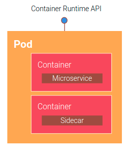

[Kubernetes](https://kubernetes.io/) is a portable, extensible, open-source platform for managing containerized workloads and services, 
that facilitates both declarative configuration and automation.

Based on Google's cluster manager Borg, Kubernetes is now the most important project of 
[CNCF](./cloud_native#cloud-native-computing-foundation-cncf): allow to develop and deploy high quality applications.

## The operating system for the cloud

Kubernetes can be considered as *the operating system for the cloud*.

An operative system manage every aspect of a processes, as scheduling it and giving it the needed resources to run.  
An operative system do this not only for a single process, but for all the process that are running on the machine,

Kubernetes does exactly the same thing, even on different machines: it is able to manage CPU, disks, RAM and network and
scale it when is necessary.

A Kubernetes system architecture can be schematized as follows:


To explain it, the Kubernetes units will be now introduced. 

## Pods



Pods are the smallest deployable units of computing that you can create and manage in Kubernetes: 
it consists in a group of one or more containers, with shared storage and network resources, and a specification for how to run the containers.  
To simplify, you can consider it as a group of Docker containers with shared namespaces and shared filesystem volumes.

A Pod's contents are always co-located and co-scheduled, and run in a shared context.

An example of pod definition could be:

```yaml
apiVersion: batch/v1
kind: Job
metadata:
  name: hello
spec:
  template:
    # This is the pod template
    spec:
      containers:
      - name: hello
        image: busybox
        command: ['sh', '-c', 'echo "Hello, Kubernetes!" && sleep 3600']
      restartPolicy: OnFailure
```

## ReplicaSets

A ReplicaSet's purpose is to maintain a stable set of replica Pods running at any given time.  
It is often used to guarantee the availability of a specified number of identical Pods,
by creating and deleting [Pods](./k8s.md#pods) as needed to reach the desired number.

An example of ReplicaSet could be:

```yaml
apiVersion: apps/v1
kind: ReplicaSet
metadata:
  name: frontend
  labels:
    app: guestbook
    tier: frontend
spec:
  replicas: 3
  selector:
    matchLabels:
      tier: frontend
  template:
    metadata:
      labels:
        tier: frontend
    spec:
      containers:
      - name: php-redis
        image: gcr.io/google_samples/gb-frontend:v3
```

:::note
Instead of this, we suggest to use [Deployments](./k8s.md#deployments)
:::

## Deployments


A Deployment provides declarative updates for [Pods](./k8s.md#pods) and [ReplicaSets](./k8s.md#replicasets).  
It is used to describe the desired system state, that is reflected by [master nodes](./k8s.md#master-nodes) to [worker nodes](./k8s.md#worker-nodes).

An example of Deployment could be:

```yaml
apiVersion: apps/v1
kind: Deployment
metadata:
  name: nginx-deployment
  labels:
    app: nginx
spec:
  replicas: 3
  selector:
    matchLabels:
      app: nginx
  template:
    metadata:
      labels:
        app: nginx
    spec:
      containers:
      - name: nginx
        image: nginx:1.14.2
        ports:
        - containerPort: 80
```

## Master nodes


A master node is a node which controls and manages a set of worker nodes and resembles a cluster in Kubernetes, 
every cluster has at least one master node.

It consists of:
- **Kube-APIServer**: acts as the frontend to the cluster. All external communication to the cluster is via the API-Server;
- **Kube-Controller-Manager**: runs a set of controllers for the running cluster.
  The controller-manager implements governance across the cluster;
- **Etcd**: the cluster state database;
- **Kube Scheduler**: schedules activities to the worker nodes based on events occurring on the etcd. 
  It also holds the nodes resources plan to determine the proper action for the triggered event.

The master's automatic scheduling takes into account the available resources on each [node](./k8s.md#worker-nodes).

## Worker nodes


Worker nodes are machines that run containerized applications: every cluster has at least one worker node,
that could be either a virtual or a physical machine, depending on the cluster.  
Each node can have multiple pods and is managed by the [master](./k8s.md#master-nodes),
that handles the pods scheduling across the nodes in the cluster.

Every node runs at least:
- **Kubelet**: a process responsible for communication between the Kubernetes Master and the Node. 
  it manages the Pods and the containers running on a machine;
- **A container runtime**: is responsible for pulling the container image from a registry, unpacking the container, and running the application.

## Conclusions

The primary strength of Kubernetes is its modularity and generality.  
Nearly every kind of application that you might want to deploy you can fit within Kubernetes, 
and no matter what kind of adjustments or tuning you need to make to your system, they're generally possible.
