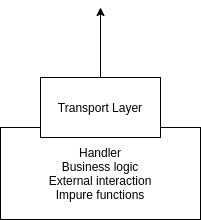
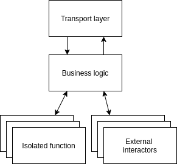

This section gathers the best practices that should be followed during the creation and management process of a 
microservices system.

## Tests

Testing is a fundamental principle of the microservice architecture. A good system is equipped with different kinds of 
test, that ensure its correctness and stability.

Three are the kinds of test that should be implemented:
- **unit tests**: a type of software testing where its *individual units*, or components, are tested;
- **integration tests**: the phase in software testing in which individual software modules are *combined and tested as a group*;
- **end to end (e2e) tests**: used to test from the end user's perspective, simulating *real user scenarios*.

### Make the code testable

In order to write the aforementioned test suites, the code should be structured in order to have limited size, and a
simplicity of features (e.g., one module must do only one thing). This allows every piece of software to be isolated, 
easy to understand, and easy to test.

The following image shows an example of bad code isolation: a single block serves multiple purposes, handling the 
business logic, the external interactions, and impure functions.

The following is an example of the same system after a refactor.

### Mocks

By design, microservices talk with external services. To test how the system behaves with these external dependencies, 
you can make use of mocks.

Even if this technique is not always applicable (e.g., when the external system has a closed source code), we suggest
another strategy as an alternative to mocks: reproduce the external system using tools like 
[Docker](https://www.docker.com/). In this way, the tests will be closer to the production system.

## Interface definition

The definition process of interfaces is used to define and describe the behavior of the system, and on top of that, it 
allows external users to better understand it. It can be imaged as a contract.

For RESTful APIs, this contract can be made in a framework and language agnostic way, using the 
[OpenAPI Specification](https://swagger.io/specification/).

There are some tools to manage it, such as:
- [Swagger UI](https://petstore.swagger.io/): used to consult the contract and try the APIs;
- [Swagger editor](https://editor.swagger.io/): used to edit the contract. It includes `Swagger UI` to create a live 
  preview of the contract;
- [Swagger codegen](https://swagger.io/tools/swagger-codegen/): used to generate the client and the server in various 
  languages.

We advise using `Swagger` tools, in order to keep your code, and your contract always aligned. The contracts should be
exposed using a unique endpoint, aggregating them in a single portal, always available for consultation.

## Scalability

Scalability is the measure of a system's ability to increase or decrease in performance and cost in response to changes 
in application and system processing demands.

To scale well, the microservices that composes the system should have a low footprint. This allows them to use all your
hardware capabilities.

### Resource monitoring

To ensure good scalability the system should be subjected to **stress tests**, a kind of tests that put a greater 
emphasis on robustness, availability, and error handling under a heavy load.

During a stress test, the usage of each resource is monitored and profiled: these data will be used to determine the right
size of the clusters that will host the microservices.

## Logging

To understand what a microservice is doing when it's running, a logging strategy is needed. A useful logging strategy is
the one that makes logs readable by humans and understandable by machines, since it can be used by every component of each 
microservice to produce logs for sensitive operations.

To know how to do it, please refer to the [logging guidelines](./logging.md).

## Dashboards

Dashboards can be used to analyze and visualize data (e.g., logs, monitoring) in a simple and clear way. They allow 
users to understand the analytics that matter to their business, department or project.

For a detailed explanation, please read the [dedicated section in monitoring](./monitoring.md#dashboards).

## Alarms

An alarm is a special message generated by particular events received from probes. Each microservice should produce an
alarm when in trouble.

To understand how to do it, please visit the [dedicated section in monitoring](./monitoring.md#alarms).

## Conclusions

In these sections we described the actions to keep in order to have the best experience with microservices. In the 
following sections you will discover how to control them and how to keep them always performant.
