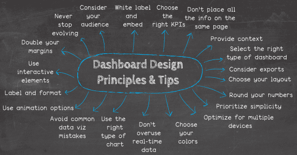
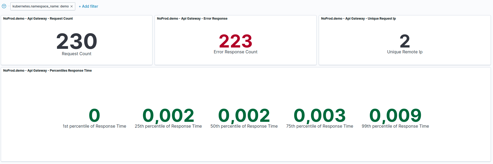

Monitoring is important to keep track of the system status:
without it, you are not sure about the correct functioning of your software.

Here we will explain the fundamental parts of a system to be monitorable.

## Dashboards

Dashboards are used to track and display key performance indicators and to analyze and visualize data (e.g. logs, monitoring) in a simple way:
they should not be limited to a specific period of time but must contain all relevant information.  
Good principles to create them can be concentrated in the following image:

The main benefit of using a dashboard is that it gives you and your team the ability to monitor the status of your entire system,
and give you the ability to fix it in real-time.

A real-world dashboard example is the following:

### KPI

Key Performance Indicators (KPIs) are the most important business metrics for your particular organization.
They're your chief ways of establishing what your business needs to achieve, and measuring whether you're on track to achieve it.

A KPI dashboard is an example of dashboard that brings all your KPIs together in one place for easy comparisons and analysis,
and could include a huge range of KPIs, from system load to general availability.

### Metrics
Even if the data to show inside a dashboard are dependent to business we will try to suggest some of them,
that are collected using metrics.

Metrics capture a value pertaining to your systems at a specific point in time and are usually collected once per second,
one per minute, or at another regular interval to monitor a system over time.  
There are two important categories of metrics: **functional** and **non-functional** metrics.  
For each system that is part of your software infrastructure,
consider which metrics are reasonably available, and collect them all.

Metrics are collected using probes; the kind of probe depends on the metric that you need:
if you need latency, you should install it on your reverse proxy.

:::note
Metrics are different to logs: they must contain general information.
:::

#### Non-functional metrics
Non-functional metrics specifies the quality attribute of a software system.  
They judge the software system based on:
- **Latency**: the delay between a user's action, and a response that have no error
- **Traffic**: show the utilization of the system
- **Errors**: how many errors occur on microservice execution
- **Saturation**: measures how full the most constrained resources of a service are
- **Resources** used by a microservice
- **Up & down time**
- **Health checks**: is the microservice running? Is it running correctly?  
  Usually it is checked using 2 kind of probes:
  - **Readiness**: used when is ready to receive traffic (is running)
  - **Liveness**: used when is running correctly

#### Functional metrics
Functional metrics are ones that provide meaningful, actionable insight into the state of your program.  
They strongly depend on the functionalities provided by the microservice and on the business
(e.g. how many times a user disconnects from the network?)

#### Good collected data
The data collected by metrics should have 4 characteristics:
- **Well-understood**: You should be able to quickly determine how each metric or event was captured and what it represents;
- **Granular**: if you collect metrics too infrequently or average values over long windows of time,
  you may lose the ability to accurately reconstruct a system's behavior;
- **Tagged by scope**: each of your hosts operates simultaneously in multiple scopes,
  and you may want to check on the aggregate health of these scopes, or their combinations;
- **Long-lived**: if you discard data too soon,
  or if after a period of time your monitoring system aggregates your metrics to reduce storage costs,
  then you lose important information about what happened in the past:
  retaining your raw data for a year or more makes it much easier to know what "normal" is

### Tools

There are various way to build dashboard, for example with combination of tools like:
- [Prometheus](https://prometheus.io/) + [Grafana](https://grafana.com/)
- [Dynatrace](https://www.dynatrace.com/) + [Prometheus](https://prometheus.io/): requires [Kubernetes](https://kubernetes.io/)
- [Kibana](https://www.elastic.co/kibana)

Sometimes these tools are not enough: is possible to combine them with custom solutions if required.

## Alarms

An alarm is a special message generated by particular events (e.g. errors above a threshold)
extracted from logs, metrics, resources, microservices status...

Alarms can be delivered to any desired channels (e.g. emails, chats or ticketing system) and must not be ignored:
to be effective is important that they can be understandable by anyone and managed using pre-defined flow 
(e.g. who will take charge of them, who will set them...). 
They must be calibrated to always be useful, with a precise description, and to be sent in a limited quantity, otherwise will be ignored.

Sometimes alarms can be agreed with the stakeholder, in order to better understand their necessities and identify the critical points of the system.

We can group them in:
- **record**: a low-urgency alert that does not notify anyone automatically but is recorded in a monitoring system in case it becomes useful for later analysis or investigation;
- **notification**: a moderate-urgency alert that notifies someone who can fix the problem using the configured channels;
- **page**: an urgent alert that underline the gravity of the situation.

### Suggested alarms flow

The alarm flow that we suggest is:  
1. Use [Prometheus](https://prometheus.io/) to call an *HTTP* metrics endpoint and collect them:
   it can also be used to make queries on collected data. 
2. Use [Grafana](https://grafana.com/) to visualize the collected data.
   [Prometheus](https://prometheus.io/) offer a solution, but we consider it too basic.
3. Generate alarms using the collected data: [Grafana](https://grafana.com/) allow metrics configuration using a GUI.

### Metrics plugins

You can extend the metrics visualized in Grafana using [datasources](https://grafana.com/docs/grafana/latest/datasources/):
every readable source can be a datasource; however we advise avoiding metrics on databases,
that can cause performance issues.

### Environment monitoring

To monitor the resource usage on each machine,
we advise the usage of [node_exporter](https://github.com/prometheus/node_exporter):
it is a [Prometheus](https://prometheus.io/) plugin used to monitor UNIX systems; for Windows, 
[Windows exporter](https://github.com/prometheus-community/windows_exporter) is recommended.

Even these data can be visualized in [Grafana](https://grafana.com/).

### Playbooks
Playbooks (or runbooks) are an important part of an alerting system:
are used to document, for each alert or family of alerts, its means and how it might be addressed.  
They must have only a few notes about exactly what the alert means, and what's currently interesting about an alert:
its content can be saved in wiki or similar tools.

## Conclusions

Monitoring a computer system is just as important as the system itself: it allows for proactive response, 
data security and data gathering, and the overall good health of a computer system.  
While monitoring does not fix problems, it does lead to more stable and reliable infrastructure.
