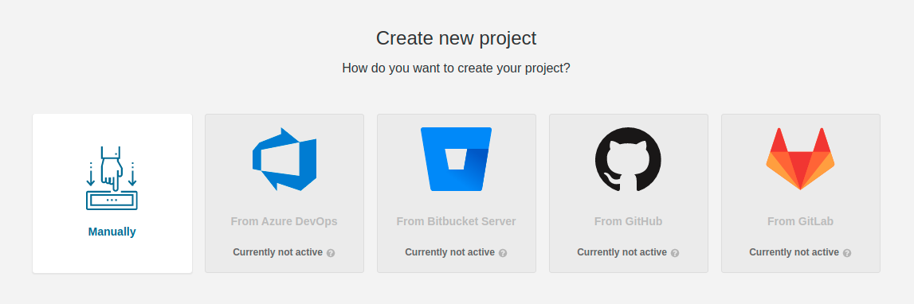
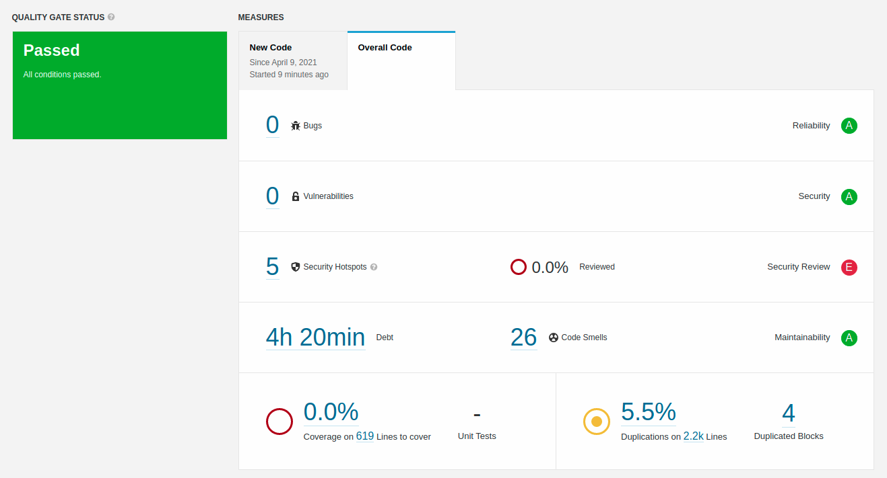
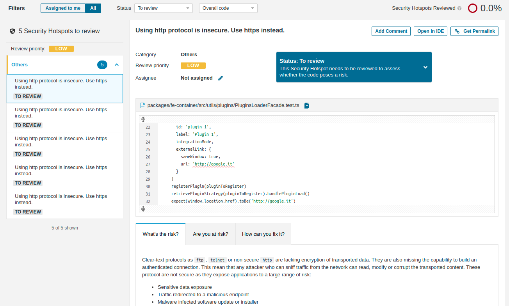
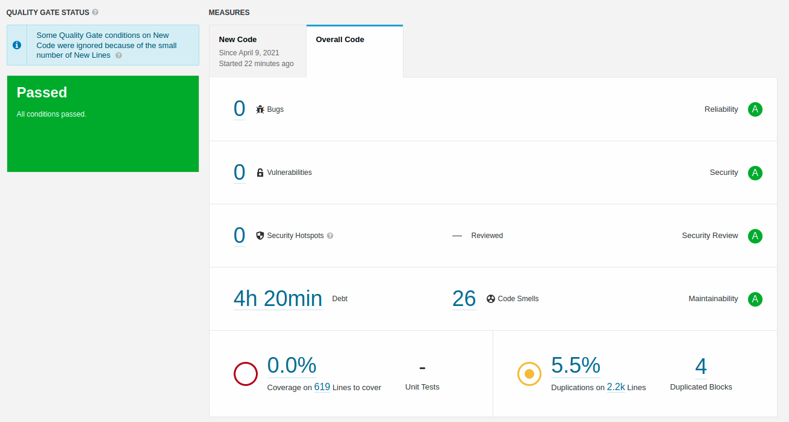
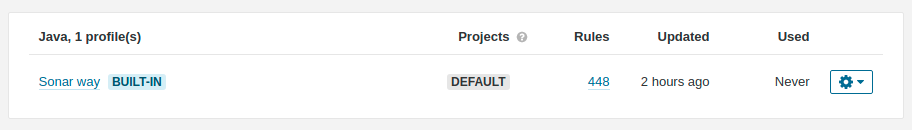
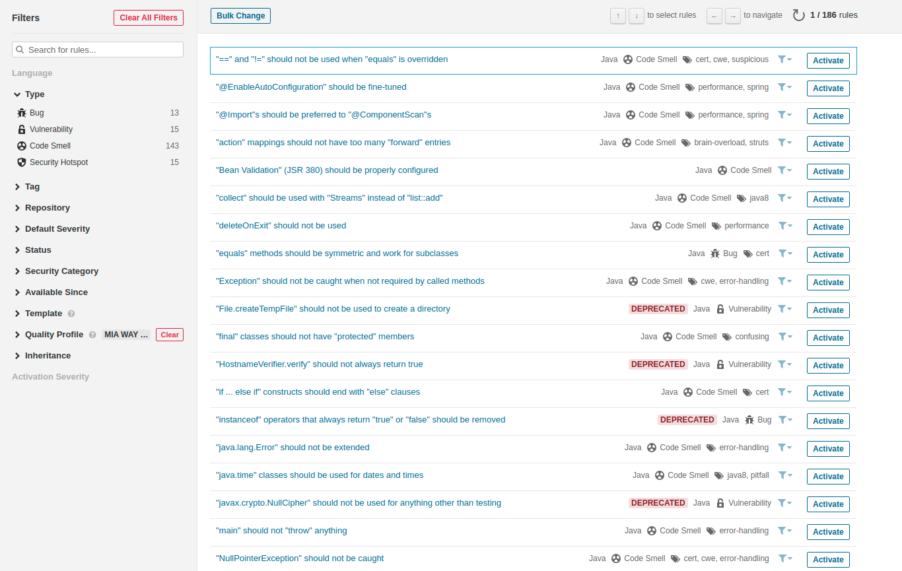
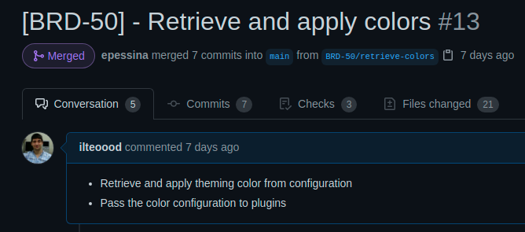
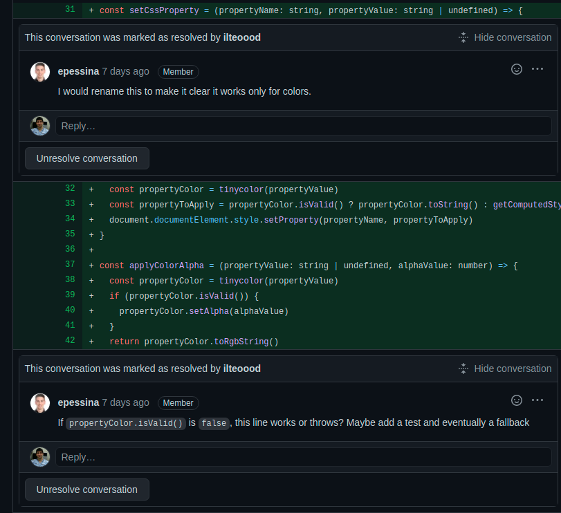
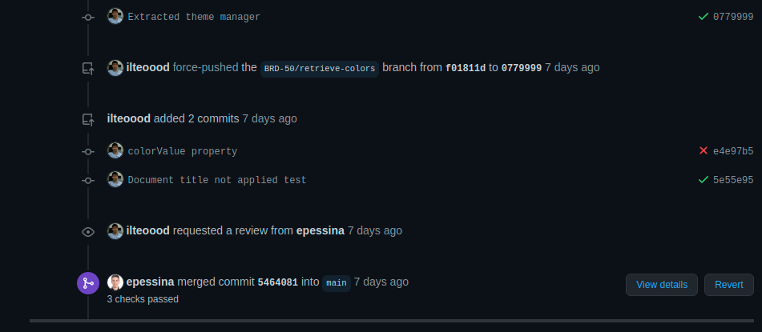

In a [previous guideline](./development.md) we presented the techniques one should adopt to write high quality code.
Keeping a high code quality is everyone's responsibility, and this section addresses how to measure and maintain it and
why it is significant for our systems.

The quality of a system codebase has a direct and deep impact on how safe, secure, and reliable the system itself is.
Writing quality code means producing quality software, which can last over time with lower security risks, minimizing
monetary losses and ensuring a fast *time to market*.

## Metrics for code quality

There exist tangible and well-defined metrics that can be used to quantify the quality of a codebase. Having a deep 
understanding of these parameters is key to approach the analysis and the enhancement of a software quality. 

It follows a brief description of each of these metrics.

#### Reliability

Reliability measures the probability that a system will run without failure over a specific period of operation. It 
relates to the number of defects and availability of the software.

#### Maintainability

Maintainability measures how easily software can be maintained. It relates to the size, consistency, structure, and
complexity of the codebase. Maintainability ensures that the code is testable and understandable.

#### Testability

Testability measures how well the software supports testing efforts. It relies on how well you can control, observe,
isolate, and automate testing, among other factors. Testability keeps under control the number of test cases needed to
have a good coverage or to find bugs.

#### Portability

Portability measures how usable the same software is in different environments, relating to platform independence. To 
make portability possible, we suggest compiling and executing the codebase in different environments and with at least
two different compilers.

#### Reusability

Reusable modules can be written and tested once, but used everywhere you need. They can increase the system stability
and reduce the time used to find and resolve new bugs. A great reusable module has as few dependencies as possible.

#### Security

Secure software ensures that outside parties can't exploit or discover vulnerabilities in the code. 

An important habit that reduces security risks is always keeping the dependencies updated. There exists several tools
that automatise this practice, like [Checkmarx](https://www.checkmarx.com/), 
[Fortify](https://www.microfocus.com/en-us/cyberres/application-security/static-code-analyzer), or
[HCL](https://www.hcltechsw.com/wps/portal/products/appscan/offerings/source).

## Measuring code quality

To keep track of the quality of your codebase we suggest using **static analysis tools**, which ensures coding standards
and finds software defects inspecting the source without executing it.

Among the various tools available for this purpose, we suggest [SonarQube](https://www.sonarqube.org/). Other notable
mentions are [CodeScene](https://codescene.com/) and [DeepSource](https://deepsource.io/).

### SonarQube

SonarQube is an automatic code review tool designed to detect bugs, vulnerabilities, and code smells in your software.
It can be easily integrated with any existing workflow to enable continuous code inspection across project branches and
pull requests.

[To install it](https://docs.sonarqube.org/latest/setup/get-started-2-minutes/) you can download a `zip` file or use a
`Docker image`. We advise the Docker route to reduce update costs.

As you can see in the image below, SonarQube perfectly integrates with the most popular version control systems, but it
still allows you to scan local source code.

Once you have configured a project, you can use the available scanners to analyze the codebase. As an example, you may 
take a look at the following dashboard

where you can easily assess that there are no bugs or vulnerabilities in the analyzed software. However, SonarQube 
highlights the presence of security hotspots and code inaccuracies, that can be further inspected looking at the security
hotspot section. 

Once the necessary fixes are applied, a new scan shows them gone.

This example has been made using the pre-defined analysis profile. Each supported language has a default profile

that can be extended with your own configuration.

## Ensuring high code quality

Measuring the quality of the codebase is key to keep it under control. Once measured, the practices outlined in the 
following sections will help you to improve it.

### Linting

A stylistic and structural consistency greatly helps to keep the codebase clean, readable, and free of errors. This
kind of consistency can be achieved through linting, a static code analysis that automatically checks the source for
programmatic and stylistic errors.

Our suggestion is to define a common set of linting rules for each programming language, standardizing them as much as
possible. For the best result it is import to apply these rules the code at each stage of the project: during the 
development through the IDE, before the commits and during the pipelines.

### Code reviews

Manually reviewing code is one of the most commonly used procedures for validating the design, and the implementation of
new features. Reviews assure software quality and help to maintain stylistic consistency in codebase managed by multiple
developers.

Code reviews allow to check each other's code for mistakes, and have been repeatedly shown to accelerate and streamline
the process of software development.

#### Best practices

A good code review is a process that requires time, since you must be sure that what is produced is production-ready 
software. To get the most out of code reviews we suggest the following guidelines.

- **Don't review too much code at a time**: with a small codebase to check, the reviewer will be able to discover more 
  defects in the software.
- **Don't pass your entire day reviewing**: a review requires a lot of concentration, which is difficult to keep for a
  long period of time. We advise making reviews last no more than an hour.
- **Create a reviewers team**: reviews should not be made by singles, otherwise bottlenecks in development may occur.
- **Everyone's code must be reviewed**: even if a developer belongs to the reviewers team, his/her code should be 
  reviewed by someone else.
- **Make useful comments**: code review is a process that allows everyone to improve their skills. Code comments like
  `this is wrong` or simply `no` are useless: try to use a friendly language like `if ... happens, this could cause an
  exception: you should...`.
- **Use a checklist**: write on a checklist the most common mistakes made during development, in order to make an initial
  skimming.

It follows an example of a good code review, starting from a short introduction of the modification:

The reviewer checks the code, applying useful comments when necessary:

The developer applies the patches, and the reviewer merges the new feature:

#### Available tools

To make code reviews we advise to use the tools already included in version control systems. However, if preferred,
there also exist dedicated applications, like [Crucible](https://www.atlassian.com/software/crucible),
[Phabricator](https://www.phacility.com/phabricator/), or [RhoDecode](https://rhodecode.com/).
