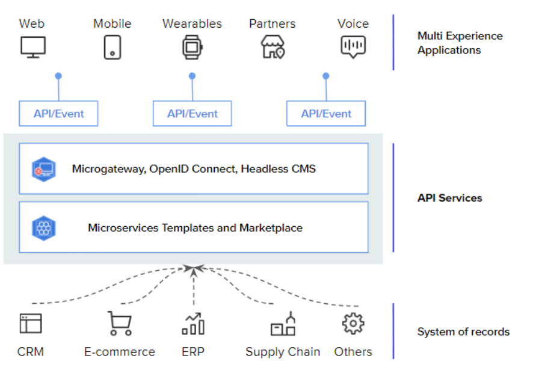

Company name manages its business through a Digital Integration Hub, an omnichannel platform based on Microservices and APIs, that is managed by a unique DevOps Console. 

The company has developed its own CRUD to access and manage its Database. Moreover, Company name has developed its own Microservices that enable the performance of several functionalities, from creating dashboards and reports, to aborting orders and sending automatic notifications. The infrastructure of Company name enables it to run a scalable and flexible business, where APIs allow easy transfer of data and access to Microservices. 

