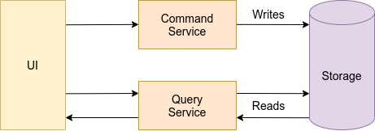

The following section provide introductory information on some of the main concepts at the base of a [Digital 
Integration Hub](../architecture/high_level_vision.md) and a [Fast Data](../architecture/fast_data.md) 
architecture.

## Microservices

The **microservice architecture** is an architectural style which dictates that an application should be structured as a
collection of small services with the following characteristics:
- highly maintainable and testable,
- loosely coupled,
- independently deployable,
- organized around business capabilities, and
- owned by a small team.

Following this pattern allows complex applications to be easily and rapidly managed and delivered, with a rich and robust
technology stack which can evolve overtime.

The [dedicated guideline](../guidelines/microservices_principles.md) provides an in-depth explanation of how to get the
most out of this architectural pattern.

## Single Views

A Single View aggregates data from multiple, potentially disconnected sources into a single, central structure that can
be easily queried by APIs. This kind of construct addresses the problem of data fragmentation and management complexity,
extracting all business entity relevant data, aggregating them in standardizing formats, and serving them to everyone.

The flow of a Single View creation begins with the aggregation of the relevant data contained in the sources. This
process is simplified by the use of **projections**, standardized copies of the sources' data designed to abstract the
interaction with the underlying systems. Each Single View should be connected with one or more projections, in such a
way that whenever a projection change occurs, the system knows which Single Views should be updated.

The [dedicated section](../architecture/single_views.md) contains more information on this topic.

## APIs

In a Digital Integration Hub, the interaction with data can be achieved through the exposition of a set of APIs. 

Considering in particular the context of a Fast Data architecture, two are the interfaces needed to be exposed by APIs: 
one for sending commands that trigger the **write** flow, and one for **reading** the data, consuming the content of 
Single Views. A detailed definition of those APIs can be found in the [APIs section](../architecture/api.md).

## CQRS

Command Query Responsibility Segregation (CQRS) is an architectural pattern which promotes a separation in the reading
and writing of data. CQRS involves splitting an application into two parts:
- the **command side** responsible for the update of data, and
- the **query side**, which gets information without changing the state of the system.

The idea behind CQRS is that the whole application works with a higher level of performance, scalability, and security
if a separation of responsibility between reading and writing elements is implemented. This is achieved through a
separation of concerns, where the command side cares only about the business, while the query side main purpose is
making queries fast and efficient.

## BFF

The Backend for Frontend (BFF) design pattern refers to the concept of developing niche backends for each frontend
application. With BFF, you can hide the endpoint of microservices from the public, abstracting references, reducing
latency, and removing a lot of the bloat caused by keeping it all in one place.

The goal of this pattern is to decouple the frontend layer from the backend architecture, practice that is
particularly useful in situations where multiple client interfaces with significantly different needs all consume the
same underlying resources.

This model flexibility makes it perfect to respond to just about any type of microservices-based situation, providing
continuous delivery of microservice architectures on a large scale.
