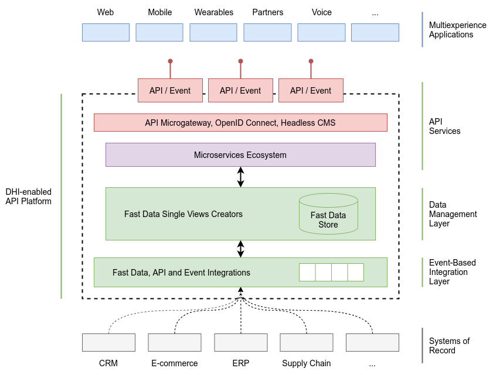

## Digital Integration Hub

[Gartner](https://www.gartner.com/en) defines the **Digital Integration Hub** (DIH) as *“an advanced application 
architecture that aggregates multiple back-end systems of record data sources into a low-latency and scale-out, 
high-performance data store”*.

The essential elements of a Digital Integration Hub are the following:
- an event-based integration layer that, relying on [Fast Data](../architecture/fast_data.md) 
  technology, collects real-time information from different sources;
- an orchestrated ecosystem of microservices to aggregate data based on business logics and build the single views 
  (e.g., of customers or products) that are necessary to applications;
- a layer of APIs that strongly decouples the touchpoints from the back-end systems and makes access to information easy
  for applications and channels;
- an appropriate management tool for unified and well-defined governance of its own DIH.

In summary, a DIH built on this architecture aggregates multiple sources of data in a data store with high performances,
low latency, and high scalability, that becomes accessible to the different touchpoints through a front-end API layer.

### Benefits

The accesses to a consolidated, yet real-time, view of data scattered across multiple systems of record is just one of 
the many benefits granted by a Digital Integration Hub. **Offloading the systems of record** from expensive workloads
generated by the API services bring a significant costs downsizing and reduces access fees by limiting API calls to SaaS
applications.

Decoupling the API services layer from the systems of record is a desirable outcome for two primary reasons:
- supporting legacy modernization by making it possible to replace some system of record applications with minimal
  impact on the API services layers, and
- normalizing the APIs for a certain application domain, so that with a single set of APIs the multi-experience
  applications can access data held in multiple systems of record (e.g., ERP applications), possibly from different
  vendors.

Another scenario in which the DHI performs greatly is proving **24/7, always-on API services**, even in situations where 
the back ends must be put offline for maintenance or upgrade. In these cases, the DIH continues to provision data, 
although certain APIs (like those triggering updates to data in the back ends) may be temporarily inhibited or limited 
in functionality.

On top of that, the analysis of DIH data may provide real-time business insight, offering additional services or 
detecting business events that require timely actions.

Finally, the DIH supports data integration requirements by sending data to other endpoints, applying appropriate 
transformation rules if needed. This enables, for example, a simpler integration between different systems of record.

### Main Technologies

The following is a list of providers with an out-of-the-box DIH-enabled API platform:

- [InsightEdge Platform](https://www.gigaspaces.com/products/insightedge),
- [Hazelcast Jet](https://hazelcast.com/products/jet/),
- [Mia-Platform](https://www.mia-platform.eu/en/),
- SAP Cloud Platform Digital Integration Hub for Industry Transformation
